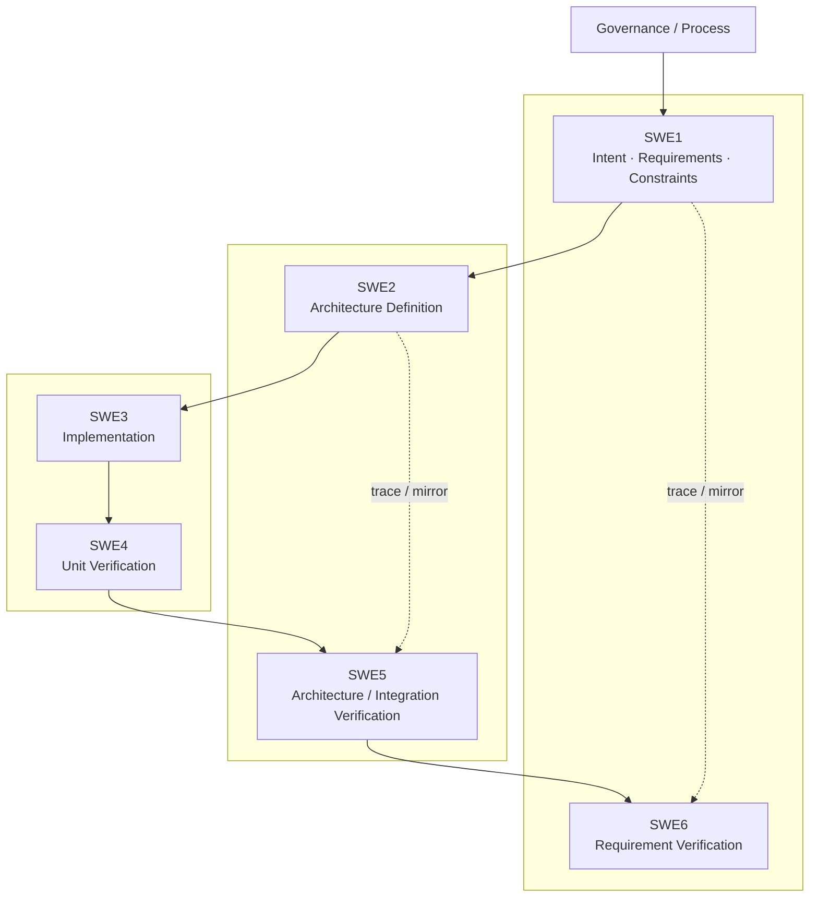

# pArc

**pArc - Process for Agentic oRchestration of symmetriC Engineering**

**Version:** 0.0.0

pArc is a vendor-neutral engineering charter for AI- and agent-assisted development. It treats agent-readable engineering artifacts as the normative source of truth and human-facing views as presentations of the same underlying artifacts. It assumes that planning, architecture, independent review, implementation, verification, deployment, and optimization may be executed by different agents, models, providers, sessions, runtimes, or physical servers.

## 1. Purpose

pArc defines reusable engineering principles, artifact responsibilities, lifecycle relationships, quality gates, role orchestration rules, and configuration-management expectations for projects developed with AI agents.

It does not prescribe a particular AI vendor, model family, IDE, cloud, agent runtime, or orchestration platform.

## 2. Core Principles

### P1. Agent-Facing Primacy

Normative engineering information MUST be available in durable, machine-readable artifacts. Human-facing documentation, wiki pages, dashboards, PDFs, and rendered diagrams are presentation and review layers, not independent sources of truth.

### P2. Symmetric Verification

The lifecycle MUST preserve a V-model relationship between definition and evidence. Requirements, architecture, detailed implementation obligations, and acceptance criteria on the left side MUST have explicit verification evidence on the corresponding right side.

### P3. Artifact-Mediated Independence

Engineering correctness MUST NOT depend on private conversational memory, a particular chat session, a proprietary agent context, or an individual model. A new qualified agent MUST be able to continue from the baselined engineering artifacts and references.

### P4. Architecture Sufficiency

Downstream implementation MUST start from a sufficiently complete and quality-gated Architecture Contract. Missing architecture MUST NOT be silently reconstructed by an implementation agent as an undocumented design decision.

### P5. Role-Orchestrated Execution

Engineering roles are defined before agents are selected. Each role SHOULD define responsibilities, authority, required inputs, required outputs, competency criteria, independence constraints, and resource requirements. Models and runtimes are replaceable resources assigned to roles.

### P6. Independent Quality Assurance

The creator of a normative artifact MUST NOT be its sole final approver. Architecture and other critical artifacts SHOULD be reviewed in an independent context; higher-risk work SHOULD use an independently qualified reviewer, potentially a different model or provider.

### P7. Capability-Proportional and Elastic Deployment

A role SHOULD be assigned the least costly resource that satisfies its quality, context, modality, latency, reliability, and tool requirements. Capacity MAY be scaled up, scaled down, replicated, or replaced as requirements and measured performance change.

### P8. Complete Knowledge, Bounded Work Context

The authoritative knowledge base SHOULD seek completeness. Individual work packages and context deliveries SHOULD be partitioned according to the capability and effective context of the assigned role. Partitioning MUST preserve traceability to the complete Architecture Contract.

### P9. Quantified Resource Economics

Agent selection and deployment SHOULD consider accepted-output quality together with token use, monetary cost, compute/energy use, latency, throughput, coordination overhead, and rework. Low unit inference cost alone is not sufficient evidence of project efficiency.

### P10. Recursive Baseline Convergence

Exploratory dialogue, implementation iterations, failures, and corrections MAY be rapid and recursive, but accepted outcomes MUST converge into explicit versioned baselines. Stable artifacts MUST contain the current engineering truth; process ledgers preserve how that truth was reached.

## 3. Lifecycle Model

pArc uses a symmetric V-model as the engineering backbone and allows Agile/DevOps-style iteration inside and between its stages.



The numbering is inspired by the Automotive SPICE software V-model for clarity and sorting. pArc artifacts are not claims of Automotive SPICE compliance unless a project independently establishes that compliance.

## 4. Artifact Model

| Artifact | Purpose | Normative status |
|---|---|---|
| `AGENTS.md` | pArc charter, principles, lifecycle, artifact rules | Reusable methodology |
| `SWE1.md` | Project instance created from `template/SWE1_Template.md` | Project input/control |
| `SWE2.md` | Project instance created from `template/SWE2_Template.md`; interactive architecture-definition ledger | Process evidence |
| `ARCH.md` | Project instance based on `template/ARCH.md`; distilled, baselined Architecture Contract | Primary downstream contract |
| `ARCH_QGate_Template.md` | Reusable copy-ready QGate worksheet plus definition/user guide | Reusable gate definition |
| `ARCH_QGate.md` | Project review instance created from `template/ARCH_QGate_Template.md` | Baseline evidence |
| `SWE3.md` | Project instance created from `template/SWE3_Template.md`; pending/failed/deferred implementation state | Process control |
| Source / tests / evidence | Implemented system and verification evidence | Product evidence |
| `refs/` | Text, schema, image, video, PDF, URL, golden/snapshot and other referenced evidence | Referenced by owning artifact |

Project-specific requirements and constraints belong in `SWE1.md`, not in this charter.

### 4.1. Public Reference Repository Layout

The reusable pArc reference repository keeps the charter at the root, reusable project templates under `template/`, and the current pArc methodology outputs under `docs/`:

```text
AGENTS.md
README.md
template/
  ARCH.md
  ARCH_QGate_Template.md
  SWE1_Template.md
  SWE2_Template.md
  SWE3_Template.md
docs/
  ARCH.md
  ARCH_QGate.md
  pArc_Position_Paper_v0.0.0.md
```

A project instantiates the files under `template/` into its own working artifact layout. The `docs/` directory in the pArc reference repository contains pArc's own current output artifacts and is not the private project process ledger.

## 5. Architecture Contract

`ARCH.md` is the durable handoff contract between architecture and downstream roles. It MUST contain the implementation-relevant architectural information required for a qualified agent to continue without access to the originating conversation.

The baseline structure SHOULD use the 12-section arc42 architecture template and MAY be extended by pArc when agentic concerns are not adequately covered.

### 5.1. Baseline Architecture Schema

1. Introduction and Goals
2. Constraints
3. Context and Scope
4. Solution Strategy
5. Building Block View
6. Runtime View
7. Deployment View
8. Cross-cutting Concepts
9. Architecture Decisions
10. Quality Requirements
11. Risks and Technical Debt
12. Glossary
13. Agent Role and Orchestration View

A section that is intentionally unused MUST be explicitly marked `N/A` or `DEFERRED`, with a rationale and a revisit condition where appropriate.

### 5.2. Diagrams

Mermaid is the default text-based diagram representation. Diagrams are part of the agent-readable engineering representation, not merely a human visualization layer.

C4 concepts MAY be used to organize architecture views:

- System Context for business, users, pArc process, and external systems.
- Container/Component views for agent services, product services, and orchestration components.
- Deployment views for model endpoints, local/cloud runtimes, compute, networking, queues, replicas, and storage.
- The symmetric V-model remains a lifecycle model and MUST NOT be redefined as a C4 code level.

## 6. Architecture Quality Gate

A baselined Architecture Contract SHOULD be independently checked against `ARCH_QGate_Template.md` before it becomes the downstream implementation contract.

The gate SHOULD cover at least:

- completeness;
- consistency;
- unambiguity;
- traceability;
- testability/verifiability;
- explicit `N/A` and `DEFERRED` decisions;
- static and dynamic architecture;
- interfaces and data ownership;
- deployment and runtime concerns;
- architecture decisions and rejected alternatives where material;
- quality requirements and failure behavior;
- security, safety, privacy, and compliance when applicable;
- role/orchestration responsibilities and authority;
- context/work partitioning when required;
- resource/cost/latency/energy constraints when material;
- independent review evidence.

Gate criteria MAY draw from arc42, Automotive SPICE, iSAQB AGENTA, C4, SDD/Spec Kit, and project-specific engineering standards.

## 7. Role and Resource Orchestration

pArc separates a **role profile** from the **agent resource** assigned to it.

A role profile SHOULD define:

- mission and lifecycle stage;
- RASIC or equivalent responsibility model;
- required inputs and outputs;
- authority and prohibited decisions;
- competency and benchmark requirements;
- context and modality requirements;
- tools and external-resource access;
- independence requirements;
- quality and reliability targets;
- latency and throughput targets;
- token, monetary, compute, and energy budgets when measurable;
- scaling, fallback, replacement, and escalation conditions.

Agent qualification SHOULD use role-relevant public benchmarks when available, project-specific evaluation, and measured project telemetry. A single vendor score SHOULD NOT be treated as sufficient qualification for all roles.

## 8. Context and Work Partitioning

The default for a small or medium project MAY be to load the complete Architecture Contract.

When the contract or repository exceeds the practical context of the assigned role, the orchestrator MAY use scoped context delivery and divide-and-conquer work partitioning. Such partitioning MUST preserve stable references to the authoritative contract and MUST allow an agent to retrieve additional authoritative context when required.

## 9. Verification Symmetry

Acceptance semantics MUST be defined on the left side of the V before the corresponding verification evidence is generated. The right side MAY choose efficient verification mechanisms, automation, instrumentation, or execution infrastructure, but MUST NOT silently invent new product acceptance semantics.

Architecture-sensitive verification findings MUST be traceable back to the requirement, architecture decision, quality criterion, or interface contract that owns the obligation.

## 10. Configuration and Baselines

A project MUST maintain recoverable, versioned baselines for normative artifacts and product state.

- State-changing work MUST have an appropriate rollback or recovery mechanism before execution.
- Existing user work and worktree changes are user-owned unless explicitly superseded.
- Changes SHOULD be minimal and scoped to the stated objective.
- Failed or unverified work MUST NOT be reported as complete.
- Public, private, generated, secret, and external-service boundaries MUST be explicit.
- A baseline version SHOULD identify the coherent state of process artifacts, Architecture Contract, source, tests, and evidence.

pArc MAY use SemVer-formatted baseline identifiers (`MAJOR.MINOR.PATCH`), while defining project/baseline semantics independently of SemVer's public-API compatibility rules.

## 11. Documentation Format

Normative text SHOULD use portable Markdown. Mermaid is the default diagram syntax. Vendor-specific Markdown extensions SHOULD NOT be required for normative meaning.

Images, video, URLs, schemas, PDFs, golden outputs, and other multimodal evidence MAY be first-class references. Normative requirements that depend on a reference SHOULD state the intended meaning in text so the contract remains interpretable when the reference cannot be rendered.

## 12. Interoperability

pArc is intentionally runtime- and provider-neutral.

- MCP may be used for Agent-to-Tool/Artifact/Resource access.
- A2A or equivalent open protocols may be used for Agent-to-Agent discovery, delegation, and communication.
- Neither protocol is required for pArc compliance; the engineering artifacts and role contracts are the stable layer.

## 13. Influences and Mapping

| Reference | pArc use |
|---|---|
| V-Model | Symmetric definition-to-verification lifecycle |
| Agile / DevOps | Fast recursive feedback and continuous delivery/operation concepts |
| Automotive SPICE 4.1 | Process discipline, traceability, configuration/baseline thinking, MAN.3 resource concepts, verification symmetry |
| arc42 | Baseline Architecture Contract schema |
| C4 Model | Context, structural, and deployment view concepts |
| iSAQB AGENTA 2026.1-rev5 | Agent-facing architecture knowledge, alignment, extraction, governance, orchestration concerns |
| Spec-Driven Development / GitHub Spec Kit | Durable specification artifacts, quality gates, cross-artifact analysis, convergence |
| SDAD | Specification-first agentic synthesis and independent verification under human authority |
| Agentic Agile-V | Agile-V lifecycle reasoning and SCOPE-V task loop |
| Harness Engineering | Durable repository knowledge, discoverability, feedback loops, context discipline |
| AGENTS.md open format | Vendor-neutral predictable location for agent guidance |
| MCP | Agent-to-tool/resource interoperability |
| A2A | Agent-to-agent interoperability |

These references are influences, not mandatory tool dependencies. Vendor-specific commands, file names, and runtimes MUST NOT be required by the pArc charter.

## 14. Human Authority

pArc is agent-facing in representation, not human-absent in governance. Humans retain authority for business intent, risk acceptance, exceptional trade-offs, and final baselines where project policy requires human accountability.

Human-facing presentations such as GitHub, GitBook, Notion, dashboards, or PDF SHOULD be generated from or synchronized with the same authoritative engineering artifacts rather than maintained as independent specifications.

## 15. Method Evolution

pArc itself SHOULD evolve through evidence. Reusable principles SHOULD be promoted only after they prove useful across projects. Project-specific lessons remain project-specific until deliberately generalized.

The methodology SHOULD prefer measurable engineering outcomes over maturity labels: quality, defect escape, rework, latency, throughput, accepted-output cost, resource utilization, and recoverability.
