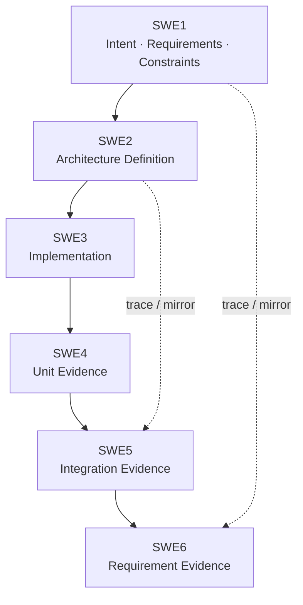
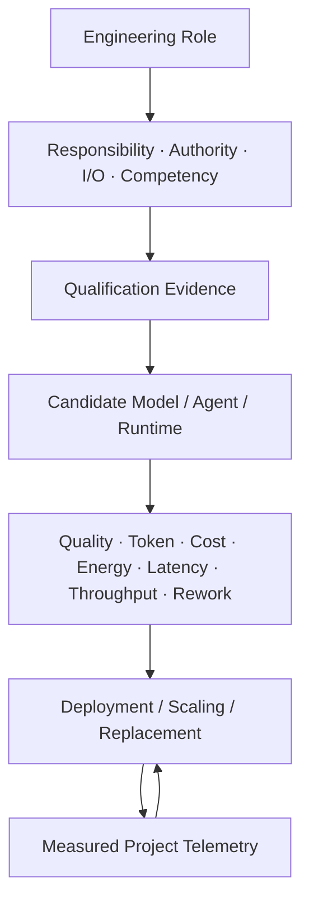

# pArc

## Process for Agentic oRchestration of symmetriC Engineering

**Architecture-Centric, Role-Orchestrated, Vendor-Neutral Agentic Engineering**  
**Baseline: 0.0.0**

[English](#english) | [한국어](#한국어)

---

<a id="english"></a>

pArc is an architecture-centered engineering process for AI agents. It treats AI agents as replaceable, distributable, and scalable **engineering resources**, and connects architecture, implementation, verification, and resource allocation through durable versioned artifacts instead of a particular model, provider, session, or proprietary conversation history.

### Documents

- [Position Paper v0.0.0 — English](docs/pArc_Position_Paper_v0.0.0.en.md)
- [Position Paper v0.0.0 — 한국어](docs/pArc_Position_Paper_v0.0.0.ko.md)
- [Position Paper v0.0.0 — PDF](docs/pArc_Position_Paper_v0.0.0.pdf)
- [Architecture Contract](docs/ARCH.md)
- [Architecture QGate](docs/ARCH_QGate.md)
- [pArc Charter](AGENTS.md)
- [Project Templates](template/)

### Core Principles

1. **Agent-Facing Primacy** — normative engineering information is stored in durable, machine-readable artifacts; Wiki, GitBook, Notion, PDF, and dashboards are presentation/review layers.
2. **Symmetric Verification** — material obligations on the left side of the V-model trace to corresponding evidence on the right.
3. **Artifact-Mediated Independence** — correctness does not depend on a specific model, provider, session, runtime, or private chat history.
4. **Architecture Sufficiency** — downstream implementation starts from a sufficiently complete, quality-gated Architecture Contract.
5. **Role-Orchestrated Execution** — engineering Roles, responsibilities, authority, I/O, and competency are defined before assigning AI resources.
6. **Independent Quality Assurance** — a normative artifact creator is not its sole final approver.
7. **Capability-Proportional Elastic Deployment** — Agents/models/runtimes can be scaled, substituted, or removed according to measured capability and cost-performance.
8. **Complete Knowledge, Bounded Work Context** — authoritative knowledge pursues completeness while work/context is partitioned to fit the assigned Role.
9. **Quantified Resource Economics** — quality, rework, token use, monetary cost, energy, latency, throughput, and coordination overhead are evaluated together.
10. **Recursive Baseline Convergence** — fast interactive work remains provisional until it converges into a versioned baseline.

### Architecture Contract

pArc uses the 12-section arc42 structure as the baseline architecture schema and adds an explicit thirteenth view:

| No. | Section | pArc treatment |
|---:|---|---|
| 1 | Introduction and Goals | Intent, stakeholders, goals, non-goals |
| 2 | Architecture Constraints | Product/project/regulatory/tool/runtime constraints |
| 3 | Context and Scope | System/environment boundary; C4 System Context where useful |
| 4 | Solution Strategy | Architectural approach and trade-offs |
| 5 | Building Block View | Static decomposition |
| 6 | Runtime View | Dynamic behavior and interaction |
| 7 | Deployment View | Runtime topology, infrastructure, network, compute |
| 8 | Cross-cutting Concepts | Security, observability, persistence, error handling, common policy |
| 9 | Architecture Decisions | ADR-style decisions inside `ARCH.md` |
| 10 | Quality Requirements | Measurable scenarios, acceptance obligations, limits |
| 11 | Risks and Technical Debt | Risks, debt, revisit triggers |
| 12 | Glossary | Domain/process vocabulary |
| **13** | **Agent Role & Orchestration View** | **Role/RASIC, capability, artifact I/O, authority, qualification, context, model/runtime placement, cost/energy, scaling and optimization** |

### Symmetric V-Model



The right side of the V produces evidence for obligations defined on the left; it does not silently redefine acceptance semantics.

### Role-Orchestrated Resource Allocation



Role qualification is not reduced to one leaderboard score. SWE2 Architecture can use architecture-specific evidence such as ArchBench and internal QGate evaluation; SWE3 implementation can use SWE-bench-family/Coding Agent benchmarks and repository acceptance tests; deployment is continuously corrected by project telemetry.

### Quantitative Resource Economics

The target is not the cheapest model. It is the lowest **accepted-output total cost** at the required quality/risk level.

$$
C_{accepted} = \frac{C_{inference}+C_{tools}+C_{compute}+C_{energy}+C_{review}+C_{rework}+C_{coord}}{N_{accepted}}
$$

Cost is paired with performance:

$$
P = (Q, R, L, T, E, C)
$$

where quality/conformance, rework/failure rate, latency, throughput, energy, and monetary/token cost are measured together.

---

<a id="한국어"></a>

pArc는 AI Agent를 단일 assistant가 아니라 교체·분산·확장 가능한 **engineering resource**로 다루는 architecture-centered process입니다. 특정 model, provider, session 또는 proprietary conversation history가 아니라 **versioned Architecture Contract와 engineering artifact**를 중심으로 설계·구현·검증·자원 배치를 연결합니다.

### 문서

- [Position Paper v0.0.0 — English](docs/pArc_Position_Paper_v0.0.0.en.md)
- [Position Paper v0.0.0 — 한국어](docs/pArc_Position_Paper_v0.0.0.ko.md)
- [Position Paper v0.0.0 — PDF](docs/pArc_Position_Paper_v0.0.0.pdf)
- [Architecture Contract](docs/ARCH.md)
- [Architecture QGate](docs/ARCH_QGate.md)
- [pArc Charter](AGENTS.md)
- [Project Templates](template/)

### 핵심 원칙

1. **Agent-Facing Primacy** — normative engineering information은 durable machine-readable artifact가 우선이며 Wiki/GitBook/Notion/PDF/dashboard는 presentation/review layer입니다.
2. **Symmetric Verification** — V-model 왼쪽의 material obligation은 오른쪽의 verification/evidence counterpart와 trace됩니다.
3. **Artifact-Mediated Independence** — correctness는 특정 model, provider, session, runtime 또는 private chat history에 의존하지 않습니다.
4. **Architecture Sufficiency** — downstream implementation은 충분히 완성되고 quality-gated된 Architecture Contract에서 시작합니다.
5. **Role-Orchestrated Execution** — AI resource를 선택하기 전에 engineering Role, responsibility, authority, I/O, competency를 먼저 정의합니다.
6. **Independent Quality Assurance** — normative artifact creator가 자신의 유일한 final approver가 되어서는 안 됩니다.
7. **Capability-Proportional Elastic Deployment** — 측정된 capability와 cost-performance에 따라 Agent/model/runtime을 증설·축소·교체할 수 있습니다.
8. **Complete Knowledge, Bounded Work Context** — authoritative knowledge는 completeness를 추구하고, 실제 work/context만 assigned Role의 능력에 맞게 분할합니다.
9. **Quantified Resource Economics** — quality, rework, token, monetary cost, energy, latency, throughput, coordination overhead를 함께 측정합니다.
10. **Recursive Baseline Convergence** — 빠른 interactive work는 versioned baseline으로 수렴하기 전까지 provisional합니다.

### Architecture Contract

pArc의 `ARCH.md`는 arc42의 12개 section을 baseline으로 사용하고 13번째 Agentic view를 추가합니다.

| No. | Section | pArc 적용 |
|---:|---|---|
| 1 | Introduction and Goals | Intent, stakeholder, goal, non-goal |
| 2 | Architecture Constraints | Product/project/regulatory/tool/runtime constraint |
| 3 | Context and Scope | System/environment boundary; 필요 시 C4 System Context |
| 4 | Solution Strategy | Architectural approach와 trade-off |
| 5 | Building Block View | Static decomposition |
| 6 | Runtime View | Dynamic behavior / interaction |
| 7 | Deployment View | Runtime topology, infrastructure, network, compute |
| 8 | Cross-cutting Concepts | Security, observability, persistence, error handling, common policy |
| 9 | Architecture Decisions | ADR-style decision을 `ARCH.md` 내부에서 관리 |
| 10 | Quality Requirements | Measurable scenario / acceptance obligation / limit |
| 11 | Risks and Technical Debt | Risk, debt, revisit trigger |
| 12 | Glossary | Domain/process vocabulary |
| **13** | **Agent Role & Orchestration View** | **Role/RASIC, capability, artifact I/O, authority, qualification, context, model/runtime placement, cost/energy, scaling/optimization** |

### Symmetric V-Model


오른쪽 V는 왼쪽에서 정의된 obligation에 대한 evidence를 생성하는 mirror이며, verification 단계가 acceptance semantics를 조용히 새로 정의하지 않습니다.

### Role-Orchestrated Resource Allocation


Role qualification은 하나의 leaderboard 점수로 고정하지 않습니다. SWE2 Architecture에는 ArchBench와 architecture-specific/internal QGate evaluation을, SWE3 implementation에는 SWE-bench 계열/Coding Agent benchmark와 repository acceptance test를 사용할 수 있으며, 실제 deployment 이후에는 project telemetry로 계속 보정합니다.

### Quantitative Resource Economics

목표는 가장 싼 model을 고르는 것이 아니라 필요한 quality/risk 수준에서 **accepted engineering output의 total cost를 최소화**하는 것입니다.

$$
C_{accepted} = \frac{C_{inference}+C_{tools}+C_{compute}+C_{energy}+C_{review}+C_{rework}+C_{coord}}{N_{accepted}}
$$

Cost에는 항상 performance가 함께 따라야 합니다.

$$
P = (Q, R, L, T, E, C)
$$

즉 accepted quality/conformance, rework/failure rate, latency, throughput, energy, monetary/token cost를 함께 측정합니다.

---

## Repository Layout

```text
pArc/
├── .gitignore
├── AGENTS.md
├── README.md
├── docs/
│   ├── ARCH.md
│   ├── ARCH_QGate.md
│   ├── pArc_Position_Paper_v0.0.0.en.md
│   ├── pArc_Position_Paper_v0.0.0.ko.md
│   └── pArc_Position_Paper_v0.0.0.pdf
└── template/
    ├── ARCH_Template.md
    ├── ARCH_QGate_Template.md
    ├── SWE1_Template.md
    ├── SWE2_Template.md
    └── SWE3_Template.md
```
