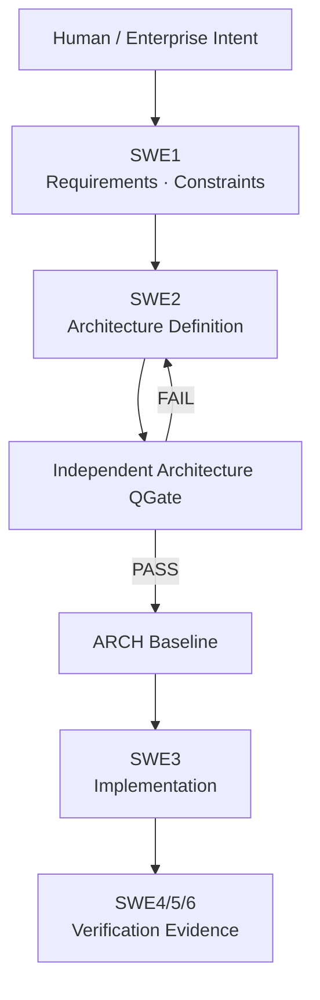

# pArc

**Process for Agentic oRchestration of symmetriC Engineering**  
**Baseline: 0.0.0**

pArc는 AI Agent를 위한 architecture-centered, vendor-neutral engineering process입니다. Agent가 직접 소비하는 durable artifact를 normative engineering representation으로 사용하고, engineering Role과 실제 Model/Runtime을 분리하며, symmetric V-model로 왼쪽의 정의와 오른쪽의 verification evidence를 연결합니다.

## 현재 Baseline

- [pArc Position Paper v0.0.0](docs/pArc_Position_Paper_v0.0.0.md)
- [pArc Architecture Contract](docs/ARCH.md)
- [pArc Architecture QGate 자가검토](docs/ARCH_QGate.md)
- [재사용 가능한 pArc Charter](AGENTS.md)
- [프로젝트 Template](template/)

현재 `0.0.0`은 방법론과 Architecture를 정리한 초기 baseline이며, empirical validation 완료나 Automotive SPICE compliance를 주장하지 않습니다.
