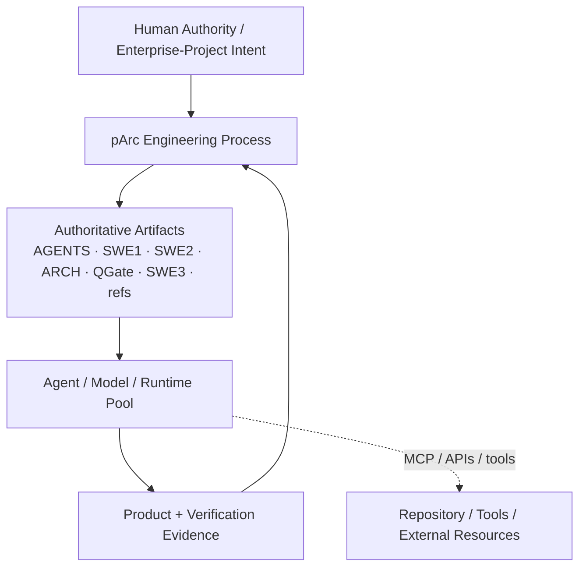
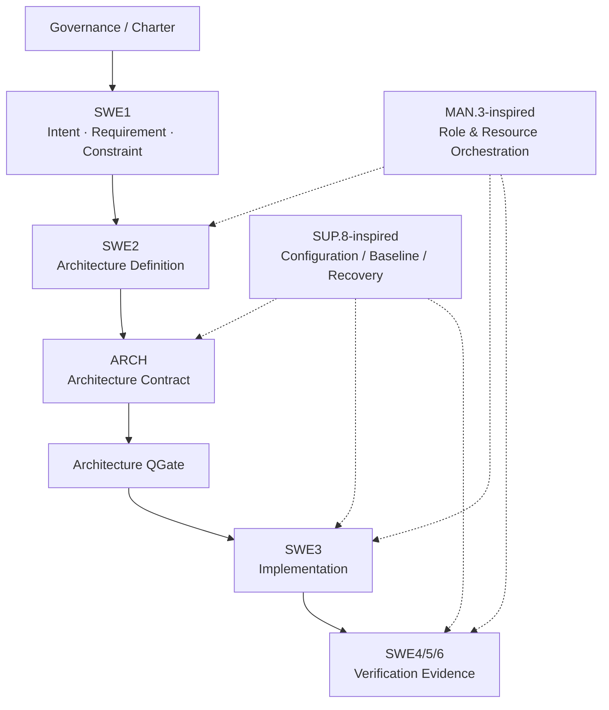
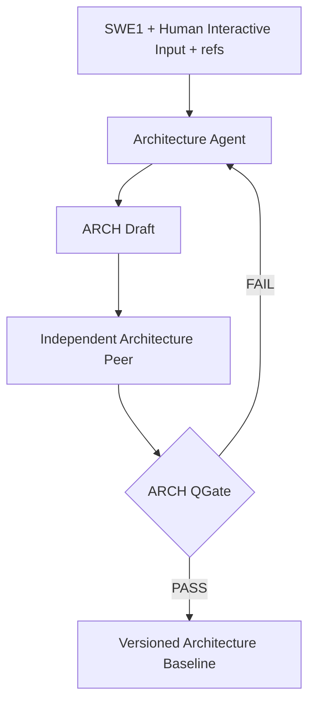
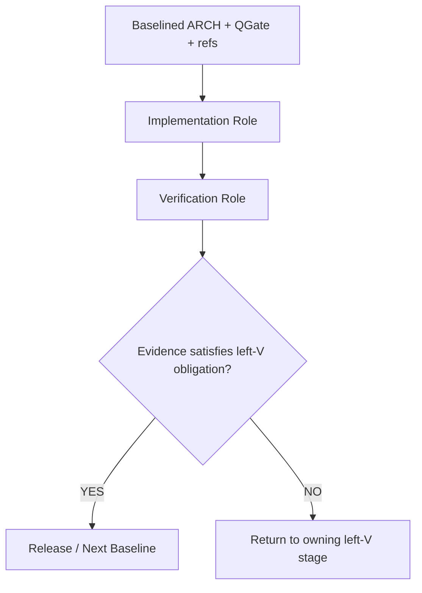
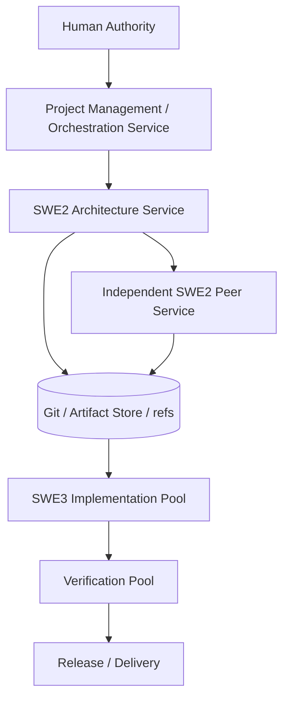

# ARCH

**pArc Architecture Contract**  
**Baseline:** 0.0.0  
**Status:** Draft Baseline Candidate

이 문서는 pArc 자체의 현재 Architecture Contract입니다. 원 설계 대화 전체를 읽지 않은 Agent도 pArc의 구조, artifact, role, lifecycle, quality gate, orchestration 원칙을 이해하고 다음 작업을 수행할 수 있어야 합니다. 기본 schema는 arc42의 12개 section을 따르고, pArc의 **Agent Role and Orchestration View**를 13번째 section으로 확장합니다.

## 0. 문서 제어

| 항목 | 값 |
|---|---|
| Project | pArc |
| Baseline | 0.0.0 |
| Status | Draft Baseline Candidate |
| Public Charter | `AGENTS.md` |
| Process Input Template | `template/SWE1_Template.md` |
| Process Ledger Template | `template/SWE2_Template.md` |
| Implementation Backlog Template | `template/SWE3_Template.md` |
| Quality Gate Definition | `template/ARCH_QGate_Template.md` |
| Quality Gate Result | `docs/ARCH_QGate.md` |
| Position Paper (EN) | `docs/pArc_Position_Paper_v0.0.0.en.md` |
| Position Paper (KO) | `docs/pArc_Position_Paper_v0.0.0.ko.md` |
| References | `refs/` |

### History

| Version | Date | Comment |
|---|---|---|
| 0.0.0 | 2026-09-10 | 최초 공개 baseline candidate. pArc 원칙, 13-section Architecture Contract, Role Orchestration, QGate 구조를 동기화함. |

---

## 1. Introduction and Goals

**Status:** REQUIRED

### 1.1. 목적

pArc는 AI Agent를 한 세션의 보조 도구가 아니라 **교체·분산·확장 가능한 engineering resource**로 취급하는 vendor-neutral engineering process다. 핵심 목표는 다음과 같다.

1. Agent-facing engineering artifact를 normative source of truth로 사용한다.
2. Architecture Contract를 role 간 durable handoff/orchestration substrate로 사용한다.
3. V-model의 좌우 symmetry를 definition ↔ verification evidence의 traceability backbone으로 사용한다.
4. Role/RASIC/competency/resource allocation을 Agent/Model/Runtime 배치에 적용한다.
5. 특정 vendor, model, IDE, orchestration runtime에 correctness가 종속되지 않게 한다.
6. Quality, token, monetary cost, latency, throughput, rework, compute/energy를 함께 측정해 resource allocation을 최적화한다.

### 1.2. Non-goals

- 특정 AI vendor 또는 model family의 사용을 강제하지 않는다.
- MCP, A2A, GitHub, GitLab 등 특정 transport/runtime을 pArc 자체로 정의하지 않는다.
- Automotive SPICE compliance 또는 assessment certification을 주장하지 않는다.
- 모든 프로젝트에 동일한 benchmark threshold, context size, model tier를 강제하지 않는다.
- 현재 baseline 0.0.0에서 오른쪽 V의 SWE4/5/6 세부 artifact format을 최종 확정하지 않는다.

### 1.3. Quality Goals

| Priority | Quality Goal | Measurable Target / Scenario |
|---:|---|---|
| 1 | Agent handoff portability | 새로운 qualified Agent가 원 planning chat 없이 `ARCH.md + refs + source baseline`으로 작업을 재개할 수 있어야 함 |
| 2 | Architecture completeness | `ARCH_QGate.md`가 모든 applicable mandatory item을 review할 수 있어야 함 |
| 3 | Vendor neutrality | Normative artifact가 vendor-specific proprietary file/context에 의존하지 않아야 함 |
| 4 | Traceability | material requirement/decision/verification obligation의 source와 evidence를 안정적으로 추적 가능해야 함 |
| 5 | Resource efficiency | Role qualification과 deployment decision에서 performance와 cost를 함께 관측 가능해야 함 |
| 6 | Recoverability | 상태 변경 전 baseline/backup/rollback 수단을 정의할 수 있어야 함 |

### 1.4. Stakeholders

| Stakeholder / Role | Concern / Expectation | Authority |
|---|---|---|
| Human Authority / Method Owner | Business intent, risk acceptance, method evolution | 최종 baseline/method decision |
| Architecture Agent | 충분한 requirement/context를 기반으로 Architecture Contract 생성 | Draft/ADR 제안 |
| Architecture Peer | 독립적으로 omission/contradiction/risk 검출 | QGate PASS/FAIL evidence |
| Implementation Agent | Architecture를 변경하지 않고 구현 | Source 변경 |
| Verification Agent | 왼쪽 V에서 정의된 criterion에 대한 evidence 생성 | Evidence/PASS-FAIL 보고 |
| Project Management / Orchestration Role | Role/resource/context/work allocation | 승인된 policy/budget 내 배치/교체/scale |

---

## 2. Constraints

**Status:** REQUIRED

### 2.1. 기술 제약

- Normative text format은 portable Markdown을 기본으로 한다.
- Diagram source는 기본적으로 Mermaid를 사용한다.
- Binary image/video/PDF는 reference가 될 수 있으나 Architecture의 병렬 SSOT가 되어서는 안 된다.
- Public reusable artifact는 Git repository로 versioning할 수 있어야 한다.

### 2.2. Process 제약

- `AGENTS.md`는 public reusable charter이며 project-specific 설정을 직접 포함하지 않는다.
- Project-specific requirement/constraint는 `SWE1.md` instance에 위치한다.
- Interactive architecture process는 `SWE2.md` instance에서 누적되고, stable result만 `ARCH.md`로 distill한다.
- 실패·deferred·retry 항목은 `SWE3.md` instance에 중앙화한다.
- Architecture decision은 별도 ADR file proliferation 없이 `ARCH.md`의 Architecture Decisions chapter에서 관리한다.
- 모든 state-changing 작업은 적용 전에 복구 가능한 checkpoint 또는 equivalent를 확보해야 한다.

### 2.3. Interoperability 제약

- Normative process는 proprietary chat memory에 의존하지 않는다.
- Vendor-specific compatibility shim은 methodology requirement가 아니다.
- MCP/A2A는 사용할 수 있으나 optional mechanism이다.

### 2.4. 비용/운영 제약

- Agent 선택은 raw token price만으로 결정하지 않는다.
- Performance와 cost를 함께 측정해야 하며 rework/coordination/latency/energy를 가능한 범위에서 포함한다.
- 공개 benchmark는 initial qualification signal이며 production/project telemetry가 누적되면 실제 성과를 우선한다.

---

## 3. Context and Scope

**Status:** REQUIRED

### 3.1. System Context

### 3.2. 책임 경계

- pArc는 engineering process, role contract, artifact contract, baseline 및 QGate 원칙을 정의한다.
- Model inference service, orchestration runtime, source-control platform, deployment platform은 교체 가능한 external implementation mechanism이다.
- Human-facing GitHub/Notion/GitBook/PDF는 authoritative artifact의 presentation/review projection이다.

### 3.3. 주요 외부 interface

| Interface ID | Partner | Direction | Contract | Ownership |
|---|---|---|---|---|
| IF-001 | Git/source-control system | bidirectional | versioned text/binary artifact | Project |
| IF-002 | Agent runtime/model provider | bidirectional | Role input/output artifact | Orchestrator/Project |
| IF-003 | Tool/resource connector | bidirectional | MCP/API/equivalent | Project |
| IF-004 | Agent-to-Agent transport | bidirectional | A2A/equivalent, optional | Project |
| IF-005 | Human presentation system | outbound/inbound review | Markdown/renderer/API | Presentation layer |

---

## 4. Solution Strategy

**Status:** REQUIRED

| Strategy ID | Driver | Strategy | Trade-off |
|---|---|---|---|
| STR-001 | Session/provider independence | Durable Architecture Contract를 handoff substrate로 사용 | 문서 정제/QGate 비용 증가 |
| STR-002 | Verification discipline | Symmetric V-model을 lifecycle backbone으로 사용 | 오른쪽 V 세부 정의가 추가로 필요 |
| STR-003 | Agent replaceability | Role Profile과 실제 Agent resource를 분리 | Qualification/telemetry 체계 필요 |
| STR-004 | Architecture completeness | arc42 12-section schema + pArc 13번째 Orchestration View | Small project에는 일부 section N/A 가능 |
| STR-005 | Low overhead | Ticket/meeting 중심 communication artifact 대신 process ledger + distilled contract 사용 | 자동 trace extraction 품질이 중요 |
| STR-006 | Cost optimization | Role-specific benchmark + project telemetry로 allocation/scale | 초기 full-run은 over-provision될 수 있음 |

---

## 5. Building Block View

**Status:** REQUIRED

### 5.1. Level 1 Decomposition

### 5.2. Building Blocks

| Block ID | Responsibility | Primary Artifact / Output |
|---|---|---|
| BB-001 Governance/Charter | pArc principles, lifecycle, artifact rules | `AGENTS.md` |
| BB-002 Requirements/Constraints | Project intent, constraints, acceptance obligations | `SWE1.md` |
| BB-003 Architecture Definition | Human+Agent interactive architecture reasoning | `SWE2.md` |
| BB-004 Architecture Contract | Distilled implementation-relevant architecture | `ARCH.md` |
| BB-005 Architecture QGate | Independent architecture quality review | `ARCH_QGate.md` |
| BB-006 Implementation Control | TODO/failed/deferred implementation state | `SWE3.md` + source |
| BB-007 Verification | Left-V obligation에 대한 evidence | tests/analysis/evidence |
| BB-008 Orchestration | Role definition, resource assignment, work/context partition, scaling | Architecture §13 + project telemetry |
| BB-009 Configuration Management | Baseline/version/backup/recovery | Git/ref/snapshot/history |

---

## 6. Runtime View

**Status:** REQUIRED

### 6.1. Architecture Definition and Review

### 6.2. Downstream Execution

### 6.3. Failure / Retry Behavior

- Architecture QGate fail → SWE2로 회귀.
- Implementation이 Architecture ambiguity를 발견 → silent design 금지, SWE2/ARCH update candidate로 회귀.
- Verification fail → failure가 속한 left-V obligation으로 trace하여 수정.
- Repeated SWE3 failure 또는 architecture-sensitive change → Architecture Peer 재활성화 가능.
- Agent/resource failure → Role Profile을 유지한 채 fallback/replacement resource로 교체 가능.

---

## 7. Deployment View

**Status:** REQUIRED

### 7.1. Logical Deployment Topology

각 Role은 같은 application/session 내부일 수도 있고, 서로 다른 model/provider/runtime/physical server pool일 수도 있다.

### 7.2. Placement Policy

- Architecture/Peer Role은 높은 reasoning/architecture qualification이 필요할 수 있다.
- Implementation Role은 baselined Architecture Contract가 충분할수록 더 낮은 reasoning/cost resource로도 수행 가능하다.
- Verification execution은 deterministic automation/local model을 우선할 수 있지만 analytical verification이 필요한 경우 별도 qualification이 필요하다.
- Peer resource는 architecture material change, repeated implementation failure, architecture-sensitive module change, quality threshold breach 시 활성화한다.
- Implementation capacity는 horizontal scale할 수 있으나 architecture authority의 변경은 별도 gate를 거친다.

### 7.3. Physical Environment

현재 0.0.0은 특정 cloud/local topology를 강제하지 않는다. 각 project instance가 다음을 정의한다.

- model endpoint / local runtime
- compute/GPU/CPU allocation
- queue/concurrency
- network/trust boundary
- storage/artifact repository
- failover/fallback
- cost/energy observability

---

## 8. Cross-cutting Concepts

**Status:** REQUIRED

| Concept ID | Concern | pArc Policy |
|---|---|---|
| XC-001 Traceability | Requirement/architecture/evidence 연결 | stable semantic ID + baseline/version + source heading/evidence 사용 |
| XC-002 Configuration | Coherent baseline | process artifact, ARCH, source, test/evidence를 같은 baseline identifier로 묶음 |
| XC-003 Recovery | State-changing work | 변경 전 checkpoint/snapshot/export/ref 및 복구 가능성 확인 |
| XC-004 Documentation | Agent-readable format | portable Markdown + Mermaid, vendor-specific syntax는 normative meaning에 필수 금지 |
| XC-005 Security/Privacy | Public/private boundary | public, private, secret, external state 경계를 명시 |
| XC-006 Observability | Orchestration economics | quality, token, monetary cost, latency, throughput, rework, compute/energy를 가능한 범위에서 기록 |
| XC-007 Context | Knowledge vs work context | authoritative knowledge는 completeness를 추구하고 task/context만 capability에 맞게 partition |
| XC-008 Independence | Peer review | design conversation의 persuasive history를 그대로 공유하지 않는 independently scoped review |

---

## 9. Architecture Decisions

**Status:** REQUIRED

| ADR ID | Status | Decision | Rationale | Evidence / Origin |
|---|---|---|---|---|
| ADR-001 | Accepted | pArc의 normative representation은 Agent-facing text artifact를 우선한다. | Handoff, portability, orchestration | Position Paper §3 P1 |
| ADR-002 | Accepted | Architecture Contract를 downstream handoff substrate로 사용한다. | Session/provider independence | Position Paper §1, §3 P3/P4 |
| ADR-003 | Accepted | Lifecycle backbone은 symmetric V-model이다. | Definition↔evidence traceability | Position Paper §6 |
| ADR-004 | Accepted | Architecture schema는 arc42 12 section을 baseline으로 한다. | 기존 검증된 architecture schema 재사용 | Position Paper §5 |
| ADR-005 | Accepted | Agent Role & Orchestration View를 13번째 section으로 추가한다. | Role/RASIC/resource economics를 명시할 기존 dedicated chapter 부재 | Position Paper §5 |
| ADR-006 | Accepted | Mermaid를 기본 diagram source로 사용한다. | Machine-readable text + human rendering | Position Paper §4 |
| ADR-007 | Accepted | QGate는 architecture creator의 self-review만으로 baseline 승인하지 않는다. | confirmation/context bias 감소 | Position Paper §6/§11 |
| ADR-008 | Accepted | 특정 vendor/model/runtime을 methodology requirement로 채택하지 않는다. | Vendor neutrality | Position Paper §10 |
| ADR-009 | Accepted | Agent qualification은 Role-specific benchmark portfolio + project telemetry를 사용한다. | 단일 benchmark의 한계와 cost-performance 최적화 | Position Paper §8/§9 |
| ADR-010 | Accepted | pArc capability maturity level을 별도 grading 체계로 만들지 않는다. | Audit grade보다 measurable operating model 우선 | Position Paper §11 |

---

## 10. Quality Requirements

**Status:** REQUIRED

| Quality ID | Attribute | Requirement / Measure |
|---|---|---|
| Q-001 | Portability | Downstream Role은 원 planning chat 없이 authoritative artifact set으로 재개 가능해야 함 |
| Q-002 | Completeness | Architecture QGate는 13개 chapter와 cross-cutting pArc requirement를 평가해야 함 |
| Q-003 | Independence | Architecture baseline review는 independently scoped context를 사용해야 함 |
| Q-004 | Traceability | Material decision/obligation은 source/evidence로 추적 가능해야 함 |
| Q-005 | Recoverability | State-changing operation은 사전에 rollback/recovery 수단을 확보해야 함 |
| Q-006 | Cost observability | Role assignment에서 quality/performance와 cost를 함께 기록 가능해야 함 |
| Q-007 | Elasticity | Role Profile을 유지한 채 Agent/model/runtime 교체·증설·축소가 가능해야 함 |
| Q-008 | Format portability | Normative meaning은 특정 editor/plugin에 종속되지 않아야 함 |

### 10.1. Quantitative Resource Model

Accepted work unit cost의 first-order model:

$$
C_{accepted} = \frac{C_{inference}+C_{tools}+C_{compute}+C_{energy}+C_{review}+C_{rework}+C_{coord}}{N_{accepted}}
$$

Performance vector:

$$
P = (Q, R, L, T, E, C)
$$

Work allocation feasibility:

$$
Context(w) \le \alpha_{a,p} EffectiveContext(a,p)
$$

$$
Capability(a,p) \ge Requirement(w,p)
$$

Optimization example:

$$
J = C + \lambda_1R + \lambda_2L + \lambda_3E + \lambda_4H
$$

Threshold와 weight는 project policy/telemetry로 calibration한다.

---

## 11. Risks and Technical Debt

**Status:** REQUIRED

| Risk ID | Description | Severity | Mitigation / Disposition | Revisit Trigger |
|---|---|---|---|---|
| RISK-001 | 오른쪽 V의 SWE4/5/6 artifact/evidence format이 미완성 | Major | 현재는 symmetry/traceability 원칙만 normative | empirical pilot 전 |
| RISK-002 | Public benchmark quality/contamination 변화 | Major | benchmark portfolio + internal eval + project telemetry | benchmark release/audit 변화 시 |
| RISK-003 | Hosted model energy measurement 부족 | Minor | provider report/estimate + observable compute 사용 | energy reporting standard 개선 시 |
| RISK-004 | 동일 model family peer의 correlated failure | Major | risk에 따라 heterogeneous reviewer 사용 | peer experiment 결과 확보 시 |
| RISK-005 | Role qualification threshold 미보정 | Major | project-specific calibration | pilot data 확보 시 |
| RISK-006 | Large repository context partition policy 미검증 | Major | stable ID + retrievable full contract 유지 | enterprise-scale case study 시 |
| RISK-007 | A2A/MCP distributed orchestration prototype 미구현 | Minor | protocol은 optional로 유지 | implementation phase 시작 시 |
| RISK-008 | pArc 자체의 empirical superiority 미검증 | Critical | Position paper로 명확히 한정, RQ1~RQ6 실험 수행 | 논문 validation phase |

---

## 12. Glossary

**Status:** REQUIRED

| Term | Definition |
|---|---|
| pArc | Process for Agentic oRchestration of symmetriC Engineering |
| Architecture Contract | downstream Agent가 원 planning chat 없이 구현/검증을 계속할 수 있도록 정제된 `ARCH.md` |
| Agent-facing | Agent가 normative engineering representation을 직접 안정적으로 소비할 수 있도록 하는 표현 원칙 |
| Human-facing | authoritative artifact의 presentation/review projection |
| Role Profile | Responsibility, authority, I/O, competency, qualification, resource/context 조건을 정의한 engineering role contract |
| QGate | Architecture baseline 전 independent quality review |
| Artifact-Mediated Independence | correctness가 특정 session/model/provider memory에 의존하지 않는 원칙 |
| Symmetric Verification | 왼쪽 V의 obligation과 오른쪽 evidence가 traceable하게 대응되는 원칙 |
| Scoped Context Delivery | 전체 authoritative contract에서 현재 Role/work에 필요한 context를 우선 제공하는 방식 |
| Effective Context | 실제 work quality를 유지하면서 Agent가 활용 가능한 context 범위 |
| RASIC | Responsible, Accountable, Support, Informed, Consulted 역할 모델 |

---

## 13. Agent Role and Orchestration View

**Status:** REQUIRED

### 13.1. Process-grouped RASIC

| Process | Activity | Human | MAN.3 Orchestrator | SWE2 Arch | SWE2 Peer | SWE3 | Verify |
|---|---|:---:|:---:|:---:|:---:|:---:|:---:|
| SUP.8 | Baseline/configuration rules | A | R | C | I | I | I |
| SUP.8 | Backup/recovery/config status | A | R | I | I | I | C |
| MAN.3 | Role/profile definition | A | R | C | C | C | C |
| MAN.3 | Budget/resource/model allocation | A | R | C | C | C | C |
| SWE1 | Intent/project constraints | A/R | S | C | C | I | C |
| SWE1 | Acceptance obligations | A | C | R | C | I | C |
| SWE2 | Architecture Contract creation | A | C | R | C | I | I |
| SWE2 | Architecture decision/deployment view | A | C | R | C | I | C |
| SWE2 | Independent ARCH QGate | A | I | C | R | I | C |
| SWE3 | Implementation to ARCH | I | A | C | I | R | C |
| SWE4/5/6 | Evidence execution/reporting | I | A | C | I | C | R |
| SPL.2 | Product release/package/delivery | A | R | C | I | S | C |
| PIM.3 | Process improvement proposal | A | R | C | C | C | C |

### 13.2. Role Qualification and Authority

| Role ID | Role | Qualification Evidence | Authority Boundary |
|---|---|---|---|
| ROLE-001 | Project Management / Orchestration | workflow benchmark, orchestration simulation, SLA/cost/rework telemetry | policy/budget 내 resource allocate/replace 가능; product obligation 재정의 금지 |
| ROLE-002 | SWE2 Architecture | ArchBench, general reasoning index, internal ARCH/QGate eval | ARCH draft/ADR 제안; self-approval 금지 |
| ROLE-003 | SWE2 Architecture Peer | architecture benchmark + stricter project threshold + review miss-rate | QGate PASS/FAIL evidence; final business authority는 Human |
| ROLE-004 | SWE3 Implementation | coding-agent benchmark, SWE-bench family, internal acceptance suite | ARCH 범위 내 source 변경; silent architecture change 금지 |
| ROLE-005 | SWE4/5/6 Verification | reproducibility, false-pass/fail, coverage, tool/analysis eval | predefined criterion에 대한 evidence 생성; acceptance semantics 창작 금지 |
| ROLE-006 | SPL.2 Product Release | release rehearsal, rollback success, package integrity | approved release/rollback policy 실행 |
| ROLE-007 | PIM.3 Process Improvement | historical cost/quality improvement, policy simulation | 개선안 제안; governance/Human이 process change 승인 |

### 13.3. Candidate Resource Selection

Initial qualification은 다음 portfolio를 사용할 수 있다.

| Concern | Candidate Evidence |
|---|---|
| Software Architecture | ArchBench + internal ARCH/QGate eval + independent reasoning signal |
| Repository Coding | Artificial Analysis Coding Agent Index / SWE-bench ecosystem / internal acceptance suite |
| General Reasoning | HLE / ARC-AGI-2 / independent composite index |
| Tool/Long-horizon Work | Terminal-Bench / workflow simulation |
| Cost Efficiency | cost/task + token/task + time/task + project telemetry |

### 13.4. Context and Work Partitioning

- Authoritative knowledge base는 completeness를 추구한다.
- Work/context는 assigned Role의 qualified capability와 effective context에 맞춰 partition한다.
- Large project에서는 logical Architecture Contract를 chapter/module 단위로 분리할 수 있으나 stable ID와 global traceability를 유지한다.
- Agent는 필요 시 additional authoritative context를 retrieve할 수 있어야 한다.

### 13.5. Scaling / Fallback / Replacement

- Role definition과 Agent/model/runtime assignment는 분리한다.
- Architecture material change → Peer mandatory.
- Architecture stable + routine implementation → Peer를 normal path에서 제외 가능.
- Repeated implementation failure / architecture-sensitive change / quality threshold breach → Peer 재활성화.
- Capacity shortage → 동일 Role Profile을 만족하는 resource replica 추가.
- Cost-performance 악화 → candidate pool에서 다른 resource로 교체.

---

## Baseline Handoff

0.0.0 baseline candidate는 다음 조건을 대상으로 한다.

- `AGENTS.md`의 pArc Charter와 본 `ARCH.md`가 핵심 원칙에서 일관됨.
- `docs/pArc_Position_Paper_v0.0.0.en.md`와 `docs/pArc_Position_Paper_v0.0.0.ko.md`가 최초 PDF SSOT의 내용을 언어별 projection으로 누락 없이 표현함.
- `template/ARCH_QGate_Template.md`가 본 Architecture Contract의 13개 chapter를 평가함.
- `docs/ARCH_QGate.md`가 현재 `ARCH.md`에 대한 review evidence를 제공함.
- Public Git repository가 root charter + `template/` + `docs/` 구조로 동기화됨.
- Open research issue와 미완성 오른쪽 V는 risk/deferred concern으로 명시되어 있음.
