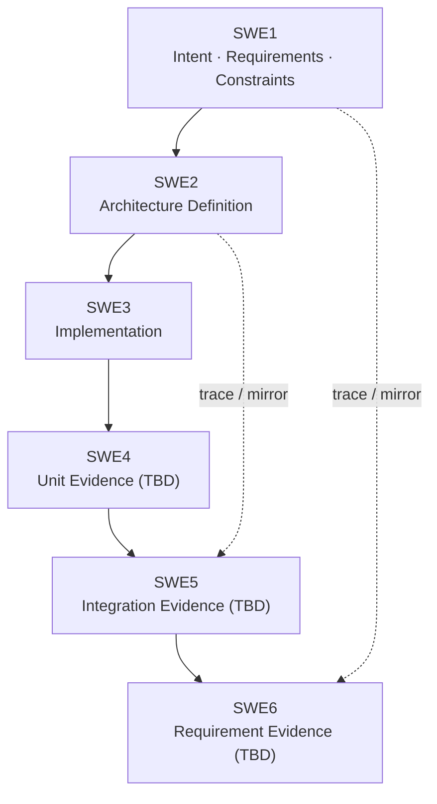
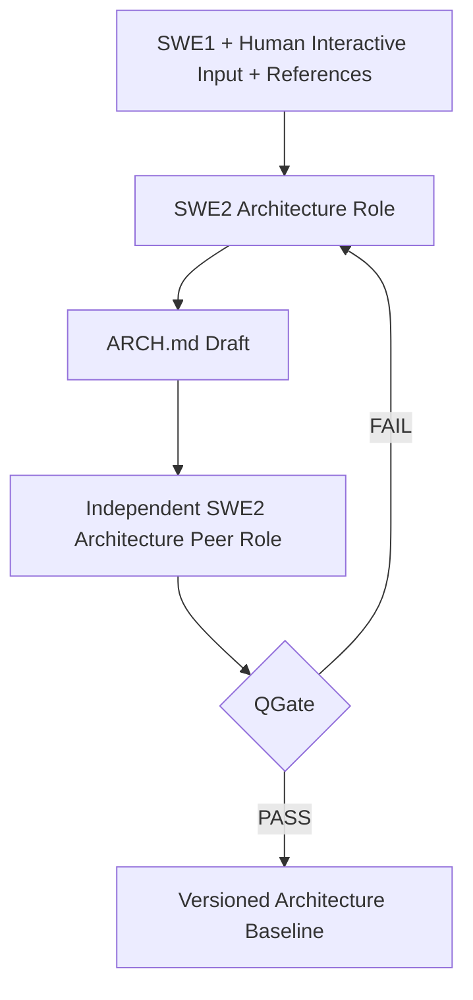
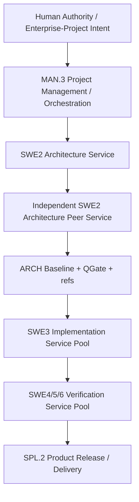

# pArc

## Process for Agentic oRchestration of symmetriC Engineering

**Architecture-Centric Position Paper for Role-Orchestrated, Vendor-Neutral Agentic Engineering**  
**Draft v0.0.0 — feasibility and structure review, not a validated standard**  
**2026-09-10**

## Abstract

Agentic software development is moving from single-session coding assistance toward systems in which planning, architecture, implementation, review, verification, release, and process optimization may be executed by different models, providers, runtimes, or physical services. Existing approaches address important parts of this problem: V-model methods define reciprocal relationships between definition and verification; Automotive SPICE formalizes process discipline, traceability, project resources, measurement, and improvement; arc42 provides a practical architecture-document schema; iSAQB AGENTA addresses architecture in agentic software-engineering contexts; Spec-Driven Development and agent harness practices externalize durable specification and repository knowledge; and A2A/MCP provide emerging interoperability mechanisms. However, these elements do not by themselves define an architecture-centered process for assigning heterogeneous AI resources to engineering roles under explicit quality, context, cost, latency, and energy constraints.

This position paper proposes **pArc**, an agent-facing engineering process in which a quality-gated **Architecture Contract** is the durable handoff and orchestration substrate. Roles are defined before agents are selected. Each role has responsibilities, authority, input/output artifacts, competency requirements, qualification benchmarks, context requirements, and resource constraints. Candidate models and runtimes can then be allocated, measured, replaced, scaled up or down, or removed from a workflow using cost-performance evidence. The paper intentionally remains a methodology draft: the right-hand verification processes, quantitative thresholds, and empirical validation are research items rather than claimed results.

**Keywords:** agentic engineering, AI orchestration, software architecture, V-model, architecture contract, role profile, RASIC, Automotive SPICE, arc42, AGENTA, cost-performance optimization, multi-agent systems

---

## 1. Motivation and Problem Statement

Current coding agents are often optimized as vertically integrated products. A planning conversation, implementation tool, execution environment, and context store may belong to one vendor or one session. That is convenient, but it creates an engineering weakness: correctness can depend on ephemeral conversational history or proprietary orchestration state. In long-lived projects, the planner, implementer, reviewer, and verifier may be different services. In enterprise deployments they may even run as separately scaled server pools with different compute economics.

pArc starts from a deliberately different assumption: **agent replacement and role redistribution are normal operating conditions**. The next engineering role must be able to proceed without access to the previous agent's private conversation chain. The durable transfer mechanism must therefore be an explicit, versioned engineering artifact.

pArc is architecture-centered because architecture is where intent, constraints, decomposition, interfaces, quality attributes, deployment topology, decisions, and verification obligations are made precise enough to support downstream execution. A strong coding model cannot reliably compensate for a missing or ambiguous Architecture Contract without implicitly repeating architectural work. pArc therefore defines an **Architecture Sufficiency Principle**: downstream execution is allowed only after the Architecture artifact passes an independent quality gate appropriate to the project.

The second motivation is economic. Human projects already distinguish architects, senior developers, test engineers, project managers, and release roles because required competencies and costs differ. Automotive SPICE MAN.3 likewise treats budget, people, infrastructure, skills, knowledge, experience, and resource allocation as explicit project-management concerns. Agentic engineering should not discard this reasoning. Instead, it can make it more measurable: model benchmark results, effective context, task latency, token use, monetary cost, GPU energy, failure rate, rework rate, and throughput can be observed directly and used for role allocation.

---

## 2. Positioning Against Existing Work

pArc does not attempt to replace the references below. It combines their strengths and extends them around the Architecture Contract and Role Orchestration.

| Reference | Primary contribution | Use in pArc |
|---|---|---|
| V-model | Reciprocal definition–verification structure | Symmetric lifecycle and traceability backbone |
| Automotive SPICE 4.x | Process discipline, resource management, configuration management, measurement, process improvement | Process naming reference, MAN.3/SUP.8 concepts, quantitative control/improvement practice |
| arc42 | Tailorable 12-section architecture template | Baseline schema for the Architecture Contract |
| C4 model | Context, container, component, code, deployment views | View semantics for system/orchestration topology; rendering remains text-based |
| iSAQB AGENTA 2026.1-rev5 | Agent-facing architecture, architecture knowledge provision, alignment, extraction, governance, orchestration concerns | Direct related work for agentic architecture and context governance |
| Spec-Driven Development / Spec Kit | Durable specification artifacts, clarification, planning, consistency checks, convergence | Iterative refinement and artifact-quality concepts without vendor/tool-specific scaffolding |
| OpenAI Harness Engineering | Repository-local authoritative knowledge, compact entry-point instruction, long-horizon agent work | Session-independent handoff and discoverable engineering knowledge |
| Agentic Agile-V / SCOPE-V | Agile-V macro-cycle and Specify–Constrain–Orchestrate–Prove–Evolve–Verify task loop | Related work for rapid agentic iteration with verification discipline |
| SDAD | Specification, agentic synthesis, independent multi-agent verification, human sign-off | Related work for independent verification and human authority |
| MCP / A2A | Agent–resource/tool interoperability / Agent–Agent interoperability | Candidate transport mechanisms; not the engineering methodology itself |

The iSAQB AGENTA curriculum published in 2026 is one of the most direct architecture references. It covers AI-assisted architectural decision-making, providing architectural knowledge to agents, alignment with architectural goals, architecture-information extraction, governance and quality gates, and the evolving architectural role. Its purpose is educational rather than a sequential process-assessment model. pArc therefore treats AGENTA as a strong knowledge source while defining an explicit artifact lifecycle, role topology, baseline transition, and resource-allocation mechanism.

---

## 3. Core Principles

The current draft proposes the following ten normative principles as the philosophical core of a future public `AGENTS.md` charter.

**P1. Agent-Facing Primacy.** Normative engineering information is optimized first for reliable agent consumption. Human-facing pages, PDFs, wikis, and dashboards are presentation and review projections of the same authoritative artifacts.

**P2. Symmetric Verification.** Every material obligation defined on the left side of the V-model should have an identifiable verification or evidence counterpart on the right side.

**P3. Artifact-Mediated Independence.** Correctness must not depend on one model, provider, session, runtime, or proprietary conversational memory.

**P4. Architecture Sufficiency.** A quality-gated Architecture Contract is a prerequisite for downstream implementation at the claimed level of autonomy.

**P5. Role-Orchestrated Execution.** Engineering roles, responsibilities, authority, inputs, outputs, and competency requirements are defined before selecting agents or models.

**P6. Independent Quality Assurance.** The creator of a normative artifact is not its sole final approver. Review must use an independently scoped context and may use a different model/provider when risk justifies it.

**P7. Capability-Proportional Elastic Deployment.** Roles use the lowest-cost resources that satisfy measured capability and quality requirements while allowing immediate scale-up or model substitution when workload or risk increases.

**P8. Complete Knowledge, Bounded Work Context.** The authoritative knowledge base pursues completeness; individual work packages and context scopes are divided according to agent capability and effective context.

**P9. Quantified Resource Economics.** Quality, accepted output, rework, tokens, monetary cost, energy, latency, throughput, and coordination overhead are measured together.

**P10. Recursive Baseline Convergence.** Fast interactive work remains provisional until it converges into an explicit versioned baseline.

---

## 4. Artifact Model

The minimal proposed file structure deliberately avoids tool-specific metadata and document proliferation.

```text
Project Root/
  AGENTS.md                  public pArc charter/method
  docs/
    ARCH.md                  project Architecture Contract
    ARCH_QGate.md            project independent review evidence
    pArc_Position_Paper_v0.0.0.en.md
    pArc_Position_Paper_v0.0.0.ko.md
  template/
    ARCH.md                  reusable Architecture Contract template
    ARCH_QGate_Template.md   reusable QGate worksheet + user guide
    SWE1_Template.md
    SWE2_Template.md
    SWE3_Template.md
  refs/                      text, schema, image, video, PDF, URL
```

`ARCH.md` is a single normative architecture artifact. JSON, YAML, images, videos, PDFs, URLs, and other files are references rather than parallel architecture definitions. Small machine-readable structures may be included in fenced code blocks. Mermaid is the default diagram language because its source remains agent-readable text while rendering as a human visual in common Markdown environments.

`SWE2.md` is not the architecture itself. It is the interactive design/process ledger. Versions are recorded as level-2 headings such as `## X.Y.Z`, while individual interactions/tasks use level-3 headings. Valid decisions are distilled into `ARCH.md`; failed paths, discussion noise, and transient reasoning do not need to pollute the Architecture Contract. `SWE3.md` centralizes deferred, failed, and future implementation work so unresolved work is not scattered across conversations.

---

## 5. Architecture Contract Schema

The `ARCH.md` schema begins with the twelve standard arc42 sections rather than inventing an entirely new architecture document. pArc adds an explicit thirteenth view.

| No. | Section | pArc treatment |
|---:|---|---|
| 1 | Introduction and Goals | Intent, stakeholders, goals, non-goals |
| 2 | Architecture Constraints | Product, project, regulatory, tool/runtime constraints |
| 3 | Context and Scope | System/environment boundaries; C4 System Context where useful |
| 4 | Solution Strategy | Architectural approach and principal trade-offs |
| 5 | Building Block View | Static decomposition; C4 Container/Component concepts where useful |
| 6 | Runtime View | Dynamic behavior and interactions |
| 7 | Deployment View | Runtime topology, infrastructure, network, compute, environments |
| 8 | Cross-cutting Concepts | Security, observability, persistence, error handling, common policies |
| 9 | Architecture Decisions | ADR-style decisions kept inside `ARCH.md` |
| 10 | Quality Requirements | Measurable scenarios, acceptance obligations, limits |
| 11 | Risks and Technical Debt | Known uncertainty, debt, revisit triggers |
| 12 | Glossary | Domain and process vocabulary |
| **13** | **Agent Role & Orchestration View** | **Role/RASIC, capability, artifact I/O, authority, qualification, context, model/runtime placement, cost/energy, scaling, optimization** |

Section 13 cross-references the arc42 Deployment View for physical placement, Quality Requirements for performance/cost constraints, Cross-cutting Concepts for common orchestration policies, and Architecture Decisions for placement rationale. This preserves the original arc42 schema while exposing an agentic engineering concern that does not have a natural dedicated chapter in the original template.

---

## 6. Symmetric Lifecycle and the SWE2 Inner Loop

The right side of the V is deliberately provisional in this draft; pArc does not yet prescribe separate SWE5/SWE6 documents. The important requirement is symmetry: right-side evidence must trace to left-side obligations rather than inventing new acceptance semantics during test execution.



**Figure 1. pArc macro V-model: left-side obligations and right-side evidence correspond reciprocally.**

SWE2 contains its own definition/review loop. A design Agent produces or updates `ARCH.md`. An independently scoped Peer Role reviews the authoritative inputs, draft architecture, references, and QGate template rather than inheriting the entire persuasive history of the design conversation. A failed gate returns to SWE2; a passed gate permits baseline transition.



**Figure 2. SWE2 inner loop: architecture creation and independent architecture review are separate Roles.**

---

## 7. Role and Responsibility Model

### 7.1. Process-grouped RASIC

The RASIC matrix follows engineering/process categories rather than a flat activity list. The table is a draft and deliberately uses recognizable Automotive SPICE process terms where they fit instead of introducing labels such as "Ops AI." The peer-review Role remains a pArc specialization inside SWE2.

`A/R/S/C/I = Accountable / Responsible / Support / Consulted / Informed`

| Process | Activity | Human | MAN.3 | SWE2 Arch | SWE2 Peer | SWE3 | Verify |
|---|---|:---:|:---:|:---:|:---:|:---:|:---:|
| SUP.8 | Baseline/configuration rules | A | R | C | I | I | I |
| SUP.8 | Backup / recovery / config status | A | R | I | I | I | C |
| MAN.3 | Role/profile definition | A | R | C | C | C | C |
| MAN.3 | Budget/resource/model allocation | A | R | C | C | C | C |
| SWE1 | Intent and project constraints | A/R | S | C | C | I | C |
| SWE1 | Acceptance obligations | A | C | R | C | I | C |
| SWE2 | Architecture Contract creation | A | C | R | C | I | I |
| SWE2 | Architecture decisions/deployment view | A | C | R | C | I | C |
| SWE2 | Independent ARCH QGate | A | I | C | R | I | C |
| SWE3 | Implementation to ARCH | I | A | C | I | R | C |
| SWE4/5/6 | Evidence execution/reporting | I | A | C | I | C | R |
| SPL.2 | Product release/package/delivery | A | R | C | I | S | C |
| PIM.3 | Process improvement proposal | A | R | C | C | C | C |

SUP.10 is **Change Request Management**, not operations. PIM.3 is **Process Improvement**, not deployment. For production release and delivery, SPL.2 Product Release is the closer Automotive SPICE term. Runtime operations beyond product release are not a strong focus of Automotive SPICE and may require future mapping to IT service/operations references rather than forcing an inaccurate ASPICE label.

### 7.2. Competency, Qualification and Authority

pArc does not hard-code arbitrary universal Role thresholds. Thresholds are calibrated to the project.

| Role | Competency / Skill | Candidate qualification evidence | Authority boundary |
|---|---|---|---|
| MAN.3 Project Management / Orchestration | Work partitioning, scheduling, resource economics, routing, risk-aware scaling | Agentic-workflow benchmarks, internal orchestration simulation, measured SLA/cost/rework | May allocate/replace resources within approved policy and budget; may not redefine product obligations |
| SWE2 Architecture | Requirements analysis, architecture synthesis, trade-offs, C4/arc42 views, ADR, quality and deployment | ArchBench, independent general-reasoning index, internal ARCH corpus/QGate evaluation | May draft architecture and propose decisions; cannot self-approve baseline |
| SWE2 Architecture Peer | Omission/contradiction/risk detection, architecture quality assessment | Architecture portfolio with stricter project threshold plus independent-review miss-rate | May PASS/FAIL QGate; final business authority remains human |
| SWE3 Implementation | Repository navigation, coding, debugging, tool use, conformance to ARCH | Artificial Analysis Coding Agent Index v1.5, SWE-bench family with caveats, internal repository acceptance suite | May modify source within ARCH; silent architecture change prohibited |
| SWE4/5/6 Verification | Deterministic execution, evidence collection, trace reporting; higher reasoning only when analysis is required | Test reproducibility, false-pass/false-fail, coverage, tool benchmarks; role-specific reasoning benchmark when analytical verification is needed | May report evidence/PASS-FAIL against predefined criteria; cannot invent acceptance semantics |
| SPL.2 Product Release | Packaging, release configuration, delivery checks | Deployment/release rehearsal, rollback success, package integrity metrics | May execute approved release/rollback policy |
| PIM.3 Process Improvement | Measurement interpretation, optimization proposals | Historical cost/quality improvement, policy simulation | May recommend changes; governance/human authority accepts process changes |

---

## 8. Benchmark Portfolio Rather Than a Single Score

SWE-bench measures repository-level issue resolution: a model receives a codebase and GitHub issue and must produce a patch that passes tests. Reasoning is used implicitly but is not isolated as a pure reasoning metric. SWE-bench is therefore appropriate evidence for SWE3 coding capability, but it is not sufficient for architecture or orchestration Roles.

For SWE2, **ArchBench** is a more direct reference because it was introduced specifically to benchmark generative AI on software-architecture tasks. Architecture qualification should also include architecture knowledge and project-specific internal evaluations. Candidate external signals for general reasoning include Humanity's Last Exam (HLE), ARC-AGI-2, and independently run composite indices such as the Artificial Analysis Intelligence Index. The latter is particularly relevant to pArc because it reports score together with token usage, cost per task, and other performance measures, enabling cost-performance comparisons rather than capability-only ranking.

As of July 2026, there is no single OpenAI-designated replacement for SWE-bench Pro. OpenAI first recommended Pro after identifying contamination/design issues in SWE-bench Verified, but later audited SWE-bench Pro, estimated roughly 30% of tasks to be broken, and explicitly retracted that recommendation. OpenAI instead called for new benchmarks built by experienced software developers with strong human oversight. Contemporary model reports therefore use a portfolio of coding and agentic evaluations rather than one successor metric. This supports the pArc position that qualification should be Role-specific and multi-metric.

| Role concern | Candidate benchmark | Interpretation |
|---|---|---|
| Software architecture | ArchBench; independent reasoning index; internal ARCH/QGate evaluation | Architecture task/knowledge capability and project-specific conformance |
| Repository coding | Artificial Analysis Coding Agent Index v1.5; SWE-bench ecosystem with caveats; internal acceptance suite | Issue resolution, terminal/tool execution, actual repository success |
| General reasoning | HLE; ARC-AGI-2; independent intelligence composite | Broad reasoning signal, not a substitute for Role-specific architecture/coding evaluation |
| Long-context work | Independent long-context reasoning evaluation; provider data as initial declaration | Context effectiveness; after deployment pArc prioritizes measured project outcomes |
| Tool/agent workflows | Terminal-Bench / automation-agent evaluations / internal workflow simulation | Long-horizon execution and tool use |
| Cost efficiency | Independent cost-per-task data + project telemetry | Capability must be paired with monetary/token/latency/energy metrics |

---

## 9. Quantitative Resource Economics

The pArc Orchestrator should behave more like a project-resource manager and cloud scheduler than a simple model router. A cheap model is not economical if it creates excessive rework, handoffs, or integration failures. Conversely, a high-cost Architecture Peer may be economical if it is invoked only at Architecture baseline transitions.

For an accepted work unit, a useful first-order cost is:

$$
C_{accepted} = \frac{C_{inference}+C_{tools}+C_{compute}+C_{energy}+C_{review}+C_{rework}+C_{coord}}{N_{accepted}}
$$

The corresponding performance vector should be retained with cost rather than reporting monetary cost alone:

$$
P = (Q, R, L, T, E, C)
$$

where:

- $Q$: accepted quality / conformance
- $R$: rework or failure rate
- $L$: latency
- $T$: throughput
- $E$: energy
- $C$: monetary/token cost

This mirrors capacity-planning practice: after an initial run, deployment is optimized from measured utilization and service-level behavior.

Work partitioning can be formalized without pretending that one universal constant exists. For work package $w$, candidate Agent $a$, and project/Role profile $p$:

$$
Context(w) \le \alpha_{a,p}\,EffectiveContext(a,p)
$$

$$
Capability(a,p) \ge Requirement(w,p)
$$

$\alpha$ is calibrated empirically. Among feasible candidates the Orchestrator can minimize an objective such as:

$$
J = C + \lambda_1 R + \lambda_2 L + \lambda_3 E + \lambda_4 H
$$

where $H$ is coordination/handoff overhead. Each $\lambda$ weight is project policy rather than a universal pArc constant.

This model reflects the same staffing trade-off found in human projects. Many low-cost Agents may require smaller tasks and more coordination, while fewer high-cost Agents may absorb larger context and reduce handoff/rework. The economic question is therefore not **"Which model is cheapest?"** but **"Which Role allocation minimizes total accepted-output cost at the required quality and risk level?"**

---

## 10. Architecture-Centric Orchestration and Deployment

The Architecture Contract is both a product-design artifact and an orchestration boundary. A pArc deployment can evolve from a single interactive environment to physically separated services without changing the engineering contract.



**Figure 3. Role topology: each service may use a different model, provider, runtime, or physical server pool.**

This structure is deliberately not tied to A2A, MCP, GitHub, GitLab, or any other orchestration runtime. MCP may expose artifacts and tools; A2A may support inter-agent task delegation; a proprietary platform may provide routing. The normative pArc layer sits above these mechanisms: **Role Profiles and Artifact Contracts must survive a runtime change.**

The Deployment View should include scaling policy. For example, an expensive Architecture Peer may be mandatory while Architecture changes materially but can be removed from the normal path when Architecture is stable and implementation changes remain within predefined boundaries. Repeated SWE3 failures, an architecture-sensitive module change, or a quality-threshold breach can trigger Peer reactivation. Implementation capacity can scale horizontally while architecture authority remains centralized.

---

## 11. Quality Gate and Verification Philosophy

`ARCH_QGate_Template.md` combines a copy-ready evaluation worksheet with a Definition/User Guide. Its primary structural baseline is the arc42 chapter schema, overlaid with process/quality criteria from Automotive SPICE, AGENTA, SDD/Harness practice, and pArc-specific orchestration concerns. Candidate checks include completeness, consistency, ambiguity, traceability, testability, explicit N/A/deferred status, architecture-deployment consistency, role/authority completeness, context suitability, independent-review separation, and cost/performance observability.

Safety-critical or business-critical acceptance criteria belong on the left side of the V. The right side is a mirror that executes tests, analyses, simulations, measurements, or inspections and produces evidence against those already-defined criteria. Verification may design instrumentation or execution mechanics, but it should not silently invent a new meaning of **acceptable**. This is especially important in agentic systems because a downstream verifier can otherwise unintentionally redefine the target while attempting to validate it.

pArc does not adopt Automotive SPICE capability-level labels as pArc maturity grades. However, the substance behind quantitative analysis/control and process innovation is useful. Instead of stopping at an audit level, pArc places measurable resource economics and closed-loop optimization directly into the expected operating model and QGate concerns when applicable.

---

## 12. Research Questions and Evaluation Plan

The present work is a position/methodology proposal. Evidence is needed before claiming superiority. The following research questions are feasible with real projects.

**RQ1.** Does an Architecture Contract allow a different implementation Agent/provider to continue work with lower architecture drift than session-history handoff?

**RQ2.** Does independent SWE2 peer review detect omissions/contradictions that self-review misses, and what is the marginal cost per defect found?

**RQ3.** Can Role-specific model allocation reduce total accepted-output cost compared with using one frontier model for all stages?

**RQ4.** How should work-package size vary with effective context, benchmark capability, and coordination cost?

**RQ5.** Can Architecture freeze reduce recurring high-cost peer-review capacity without increasing integration failures?

**RQ6.** Do token, monetary cost, energy, latency, and rework jointly form a useful placement objective for enterprise Agent infrastructure?

A practical empirical program would use two or three open-source or personal projects of different sizes. Each project would maintain the same pArc artifacts, then run controlled substitutions of Architecture, Implementation, and Review models. Measured outputs would include QGate findings, architectural conformance defects, implementation success, regression failure, context/token use, wall-clock latency, monetary cost, energy where observable, and rework. Public leaderboards are useful for initial qualification, but project telemetry should dominate later placement decisions.

---

## 13. Threats to Validity and Open Issues

The current limitations are explicit.

1. Public benchmark quality is unstable. SWE-bench Verified suffered contamination, and SWE-bench Pro was later found to contain substantial task defects. A portfolio and internal calibration are needed, but that can make cross-provider comparison harder.
2. Energy measurement is often unavailable for hosted inference and may require provider reporting or estimation.
3. Independently scoped review using the same model family is not fully independent. Heterogeneous model/provider review may reduce correlated failure but costs more.
4. The right-hand V-model and release/operations semantics are not yet fully specified in pArc.
5. Role Profile and optimization-objective thresholds require empirical calibration rather than arbitrary universal numbers.

Finally, pArc should not be presented as an Automotive SPICE derivative or compliance model. It borrows useful process concepts and numbering conventions while targeting a different purpose: operational orchestration of heterogeneous AI engineering resources around durable architecture artifacts.

---

## 14. Conclusion

pArc proposes an architecture-centric answer to a practical enterprise question: if AI Agents become engineering resources rather than one assistant session, how should Roles, artifacts, quality gates, and compute economics be organized?

The core answer is to make the **Architecture Contract the durable handoff substrate**, define Roles before selecting Agents, mirror left-side obligations with right-side evidence, qualify Agents using Role-specific benchmark portfolios, and continuously optimize deployment using measured quality and cost-performance data.

The proposal is intentionally incomplete. Its immediate next work is to finalize the arc42-based Architecture Contract schema, validate and improve the Architecture QGate template, define formal Role Profiles and baseline transitions, and then test the approach across real projects with Agent substitution and cost/rework measurement. If those experiments support the hypotheses, pArc can mature from a position paper into a reusable open engineering method and a concrete contribution to the emerging agentic architecture community.

---

## References

1. arc42. *arc42 Documentation / Overview*. https://arc42.org/overview/
2. VDA QMC. *Automotive SPICE Process Assessment Model*, current 4.x family and 2026 update context. https://vda-qmc.de/en/automotive-spice/
3. iSAQB. *AGENTA — Architecture for Agentic Software Engineering Contexts, 2026.1-rev5*. https://public.isaqb.org/curriculum-agenta/curriculum-agenta-en.pdf
4. Simon Brown. *The C4 Model for Visualising Software Architecture*. https://c4model.com/
5. GitHub. *Spec Kit / Spec-Driven Development*. https://github.com/github/spec-kit
6. OpenAI. *Harness Engineering: Leveraging Codex in an Agent-First World*. https://openai.com/index/harness-engineering/
7. OpenAI. *Separating Signal from Noise in Coding Evaluations*, 8 July 2026. https://openai.com/index/separating-signal-from-noise-coding-evaluations/
8. SWE-bench. *SWE-bench: Can Language Models Resolve Real-World GitHub Issues?* https://www.swebench.com/
9. ICSA 2026. *ArchBench: Benchmarking Generative-AI for Software Architecture Tasks*. https://arxiv.org/abs/2603.17833
10. Artificial Analysis. *Coding Agent Index v1.5*, combining DeepSWE v1.1, Terminal-Bench 4.0, and SWE-Atlas-QnA with cost/token/time metrics. https://artificialanalysis.ai/agents/coding-agents
11. Terminal-Bench. *Terminal-Bench 4.0*. https://www.tbench.ai/
12. Artificial Analysis. *Artificial Analysis Intelligence Index v4.3*. https://artificialanalysis.ai/evaluations/artificial-analysis-intelligence-index
13. ARC Prize. *ARC-AGI-2*. https://arcprize.org/arc-agi/2
14. A2A Protocol. *Agent2Agent Protocol Specification*. https://a2a-protocol.org/
15. Model Context Protocol. *MCP Specification*. https://modelcontextprotocol.io/
16. *Agentic Agile-V / SCOPE-V*, arXiv:2605.20456 (2026).
17. *Specification-Driven Agentic Development (SDAD)*, arXiv:2608.20341 (2026).
