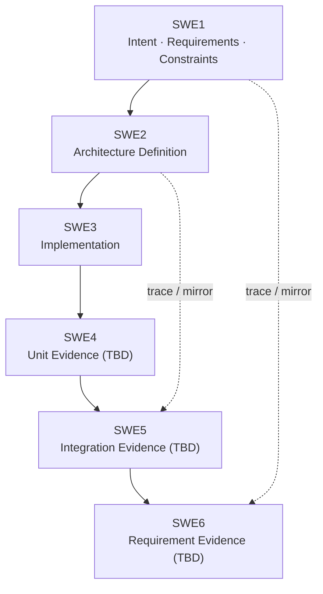
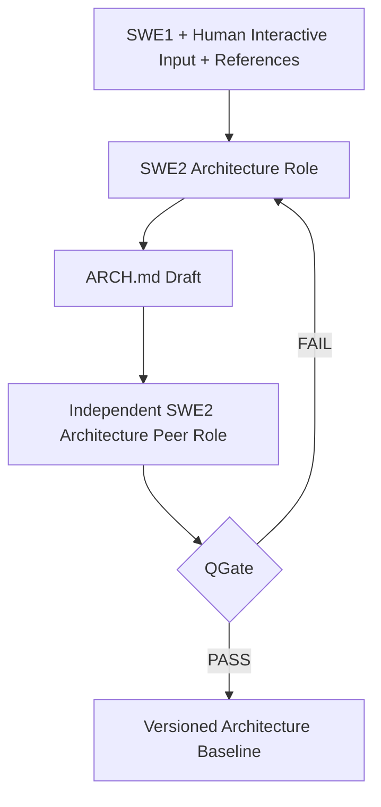
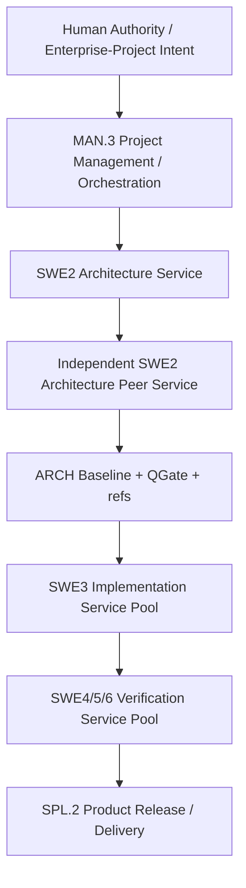

# pArc

## Process for Agentic oRchestration of symmetriC Engineering

**Architecture-Centric Position Paper for Role-Orchestrated, Vendor-Neutral Agentic Engineering**  
**Draft v0.0.0 — feasibility and structure review, not a validated standard**  
**2026-09-10**

## 초록

Agentic software development는 단일 세션의 coding assistance에서 벗어나 planning, architecture, implementation, review, verification, release, process optimization을 서로 다른 model, provider, runtime 또는 물리적 service가 수행하는 방향으로 이동하고 있다. 기존 접근은 이 문제의 중요한 부분을 각각 다룬다. V-model은 definition과 verification 사이의 대칭 관계를 제공하고, Automotive SPICE는 process discipline, traceability, project resource, measurement, improvement를 정형화하며, arc42는 실용적인 architecture-document schema를 제공한다. iSAQB AGENTA는 agentic software-engineering context에서의 architecture를 다루고, Spec-Driven Development와 agent harness practice는 durable specification 및 repository knowledge를 외부화하며, A2A/MCP는 interoperability mechanism을 제공한다. 그러나 이 요소들만으로는 explicit quality, context, cost, latency, energy constraint 아래 heterogeneous AI resource를 engineering role에 배치하는 architecture-centered process가 완성되지 않는다.

본 position paper는 **pArc**를 제안한다. pArc는 quality-gated **Architecture Contract**를 durable handoff 및 orchestration substrate로 사용하는 agent-facing engineering process다. Role을 Agent보다 먼저 정의하며, 각 Role은 responsibility, authority, input/output artifact, competency requirement, qualification benchmark, context requirement, resource constraint를 가진다. 이후 candidate model/runtime을 cost-performance evidence에 따라 배치하고, 측정하고, 교체하고, 증설·축소하거나 경로에서 제외할 수 있다. 본 문서는 의도적으로 methodology draft에 머문다. 오른쪽 V의 verification process, quantitative threshold, empirical validation은 아직 연구 항목이며 검증된 결과로 주장하지 않는다.

**키워드:** agentic engineering, AI orchestration, software architecture, V-model, architecture contract, role profile, RASIC, Automotive SPICE, arc42, AGENTA, cost-performance optimization, multi-agent systems

---

## 1. Motivation and Problem Statement

현재 coding agent는 종종 vertically integrated product로 최적화된다. Planning conversation, implementation tool, execution environment, context store가 하나의 vendor나 session에 속할 수 있다. 이는 편리하지만 engineering weakness를 만든다. Correctness가 ephemeral conversational history 또는 proprietary orchestration state에 의존할 수 있기 때문이다. 장기 프로젝트에서는 planner, implementer, reviewer, verifier가 서로 다른 service일 수 있고, enterprise deployment에서는 서로 다른 compute economics를 가진 별도 server pool로 scale될 수도 있다.

pArc는 의도적으로 다른 가정에서 시작한다. **Agent replacement와 role redistribution을 정상적인 운영 조건으로 본다.** 다음 engineering role은 이전 Agent의 private conversation chain에 접근하지 않고도 진행할 수 있어야 한다. 따라서 durable transfer mechanism은 명시적이고 versioned된 engineering artifact여야 한다.

pArc가 architecture-centered인 이유는 architecture가 intent, constraint, decomposition, interface, quality attribute, deployment topology, decision, verification obligation을 downstream execution이 가능한 수준으로 구체화하는 지점이기 때문이다. 강력한 coding model도 누락되거나 모호한 Architecture Contract를 안정적으로 보완할 수 없다. 그 경우 Agent가 사실상 architectural work를 다시 수행하게 된다. 따라서 pArc는 **Architecture Sufficiency Principle**을 둔다. Downstream execution은 project에 적합한 independent quality gate를 Architecture artifact가 통과한 뒤에만 허용한다.

두 번째 동기는 economics다. 인간 프로젝트도 architect, senior developer, test engineer, project manager, release role을 구분한다. 필요한 competency와 비용이 다르기 때문이다. Automotive SPICE MAN.3도 budget, people, infrastructure, skill, knowledge, experience, resource allocation을 명시적인 project-management concern으로 취급한다. Agentic engineering은 이 사고방식을 버릴 이유가 없다. 오히려 model benchmark result, effective context, task latency, token use, monetary cost, GPU energy, failure rate, rework rate, throughput을 직접 관측하여 Role 배치에 사용할 수 있다.

---

## 2. Positioning Against Existing Work

pArc는 아래 reference를 대체하려고 하지 않는다. 각 접근의 강점을 조합하고, Architecture Contract와 Role Orchestration을 중심으로 확장한다.

| Reference | Primary contribution | pArc에서의 사용 |
|---|---|---|
| V-model | Definition–verification의 reciprocal structure | Symmetric lifecycle 및 traceability backbone |
| Automotive SPICE 4.x | Process discipline, resource management, configuration management, measurement, process improvement | Process naming 참고, MAN.3/SUP.8 개념, quantitative control/improvement practice |
| arc42 | Tailorable 12-section architecture template | Architecture Contract의 baseline schema |
| C4 model | Context, container, component, code, deployment view | System/orchestration topology의 view semantics; rendering은 text-based로 유지 |
| iSAQB AGENTA 2026.1-rev5 | Agent-facing architecture, architecture knowledge provision, alignment, extraction, governance, orchestration concern | Agentic architecture와 context governance의 직접 related work |
| Spec-Driven Development / Spec Kit | Durable specification artifact, clarification, planning, consistency check, convergence | Vendor/tool-specific scaffolding은 채택하지 않고 iterative refinement와 artifact-quality concept를 사용 |
| OpenAI Harness Engineering | Repository-local authoritative knowledge, compact entry-point instruction, long-horizon agent work | Session-independent handoff와 discoverable engineering knowledge |
| Agentic Agile-V / SCOPE-V | Agile-V macro-cycle 및 Specify–Constrain–Orchestrate–Prove–Evolve–Verify task loop | 빠른 agentic iteration과 verification discipline의 related work |
| SDAD | Specification, agentic synthesis, independent multi-agent verification, human sign-off | Independent verification과 human authority의 related work |
| MCP / A2A | Agent–resource/tool interoperability / Agent–Agent interoperability | Candidate transport mechanism; engineering methodology 자체는 아님 |

2026년에 공개된 iSAQB AGENTA는 현재 가장 직접적인 architecture reference 중 하나다. 이 curriculum은 AI-assisted architectural decision-making, agent에 architectural knowledge 제공, architectural goal alignment, architecture-information extraction, governance/quality gate, evolving architectural role을 다룬다. 다만 목적은 sequential process-assessment model이 아니라 교육 curriculum이다. 따라서 pArc는 AGENTA를 강한 knowledge source로 사용하되, explicit artifact lifecycle, role topology, baseline transition, resource-allocation mechanism을 별도로 정의한다.

---

## 3. Core Principles

현재 draft는 향후 public `AGENTS.md` charter의 철학적 core가 될 수 있도록 다음 10개 normative principle을 제안한다.

**P1. Agent-Facing Primacy.** Normative engineering information은 Agent가 안정적으로 소비할 수 있도록 우선 최적화한다. Human-facing page, PDF, wiki는 동일 authoritative artifact의 presentation/review projection이다.

**P2. Symmetric Verification.** V-model 왼쪽에서 정의된 모든 material obligation은 오른쪽에서 식별 가능한 verification/evidence counterpart를 가져야 한다.

**P3. Artifact-Mediated Independence.** Correctness는 특정 model, provider, session, runtime 또는 proprietary conversational memory에 의존해서는 안 된다.

**P4. Architecture Sufficiency.** Quality-gated Architecture Contract는 해당 autonomy level에서 downstream implementation의 선행조건이다.

**P5. Role-Orchestrated Execution.** Engineering role, responsibility, authority, input, output, competency requirement를 Agent/model보다 먼저 정의한다.

**P6. Independent Quality Assurance.** Normative artifact의 creator는 자신의 유일한 최종 approver가 될 수 없다. Review는 independently scoped context를 사용해야 하며, risk가 충분히 크면 다른 model/provider를 사용할 수 있다.

**P7. Capability-Proportional Elastic Deployment.** 측정된 capability와 quality requirement를 만족하는 가장 낮은 비용의 resource를 Role에 배치하되 workload/risk 증가 시 즉시 scale-up 또는 model substitution이 가능해야 한다.

**P8. Complete Knowledge, Bounded Work Context.** Authoritative knowledge base는 completeness를 추구하되 개별 work package와 context scope는 Agent capability와 effective context에 맞춰 분할한다.

**P9. Quantified Resource Economics.** Quality, accepted output, rework, token, monetary cost, energy, latency, throughput, coordination overhead를 함께 측정한다.

**P10. Recursive Baseline Convergence.** 빠른 interactive work는 explicit versioned baseline으로 수렴하기 전까지 provisional하다.

---

## 4. Artifact Model

최소 file structure는 tool-specific metadata와 document proliferation을 피한다.

```text
Project Root/
  AGENTS.md                  public pArc charter/method
  docs/
    ARCH.md                  project Architecture Contract
    ARCH_QGate.md            project independent review evidence
    pArc_Position_Paper_v0.0.0.en.md
    pArc_Position_Paper_v0.0.0.ko.md
  template/
    ARCH.md                  reusable Architecture Contract template
    ARCH_QGate_Template.md   reusable QGate worksheet + user guide
    SWE1_Template.md
    SWE2_Template.md
    SWE3_Template.md
  refs/                      text, schema, image, video, PDF, URL
```

`ARCH.md`는 하나의 normative architecture artifact다. JSON, YAML, image, video, PDF, URL 및 기타 파일은 parallel architecture definition이 아니라 reference로 취급한다. 작은 machine-readable structure는 fenced code block으로 포함할 수 있다. Diagram의 기본 language는 Mermaid다. Source 자체가 Agent가 읽을 수 있는 text이고, 동시에 일반 Markdown 환경에서 human visual로 render할 수 있기 때문이다.

`SWE2.md`는 architecture 그 자체가 아니다. Interactive design/process ledger다. Version은 level-2 heading(예: `## X.Y.Z`), 개별 interaction/task는 level-3 heading으로 기록한다. 유효한 decision은 `ARCH.md`로 distill되고, failed path, discussion noise, transient reasoning은 Architecture Contract를 오염시키지 않는다. `SWE3.md`는 deferred, failed, future implementation work를 중앙화하여 unresolved work가 conversation 전체에 흩어지는 것을 방지한다.

---

## 5. Architecture Contract Schema

`ARCH.md` schema는 완전히 새로운 architecture 문서를 발명하기보다 arc42의 12개 standard section을 시작점으로 삼는다. pArc는 여기에 explicit 13번째 view를 추가한다.

| No. | Section | pArc treatment |
|---:|---|---|
| 1 | Introduction and Goals | Intent, stakeholder, goal, non-goal |
| 2 | Architecture Constraints | Product, project, regulatory, tool/runtime constraint |
| 3 | Context and Scope | System/environment boundary; 필요 시 C4 System Context |
| 4 | Solution Strategy | Architectural approach와 주요 trade-off |
| 5 | Building Block View | Static decomposition; 필요 시 C4 Container/Component concept |
| 6 | Runtime View | Dynamic behavior와 interaction |
| 7 | Deployment View | Runtime topology, infrastructure, network, compute, environment |
| 8 | Cross-cutting Concepts | Security, observability, persistence, error handling, common policy |
| 9 | Architecture Decisions | ADR-style decision을 `ARCH.md` 내부에 유지 |
| 10 | Quality Requirements | Measurable scenario, acceptance obligation, limit |
| 11 | Risks and Technical Debt | Known uncertainty, debt, revisit trigger |
| 12 | Glossary | Domain/process vocabulary |
| **13** | **Agent Role & Orchestration View** | **Role/RASIC, capability, artifact I/O, authority, qualification, context, model/runtime placement, cost/energy, scaling, optimization** |

Section 13은 physical placement에 대해서는 arc42 Deployment View, performance/cost constraint에 대해서는 Quality Requirements, 공통 orchestration policy는 Cross-cutting Concepts, placement rationale는 Architecture Decisions와 cross-reference한다. 이렇게 하면 원래 arc42 schema를 약화시키지 않으면서 원 template에 자연스러운 전용 chapter가 없는 agentic engineering concern을 명시적으로 노출할 수 있다.

---

## 6. Symmetric Lifecycle and the SWE2 Inner Loop

오른쪽 V는 이 draft에서 의도적으로 provisional 상태다. pArc는 아직 별도의 SWE5/SWE6 문서를 규정하지 않는다. 핵심 requirement는 symmetry다. 오른쪽의 evidence는 왼쪽의 obligation에 trace되어야 하며, test execution 단계에서 새로운 acceptance semantics를 발명해서는 안 된다.



**Figure 1. pArc macro V-model: left-side obligation과 right-side evidence는 reciprocal하게 대응한다.**

SWE2 내부에는 별도의 definition/review loop가 있다. Design Agent가 `ARCH.md`를 생성·수정하고, independently scoped peer role은 design conversation 전체의 설득 history를 이어받는 대신 authoritative input, draft architecture, reference, QGate template만을 review한다. Gate가 실패하면 SWE2로 돌아가고, 통과하면 baseline transition을 허용한다.



**Figure 2. SWE2 inner loop: architecture creation과 independent architecture review는 서로 다른 Role이다.**

---

## 7. Role and Responsibility Model

### 7.1. Process-grouped RASIC

RASIC matrix는 flat activity list가 아니라 engineering/process category를 따라야 한다. 아래 표는 draft이며, `Ops AI` 같은 신조어 대신 적합한 경우 recognizable ASPICE process term을 의도적으로 사용한다. Peer-review role은 SWE2 내부의 pArc specialization으로 둔다.

`A/R/S/C/I = Accountable / Responsible / Support / Consulted / Informed`

| Process | Activity | Human | MAN.3 | SWE2 Arch | SWE2 Peer | SWE3 | Verify |
|---|---|:---:|:---:|:---:|:---:|:---:|:---:|
| SUP.8 | Baseline/configuration rules | A | R | C | I | I | I |
| SUP.8 | Backup / recovery / config status | A | R | I | I | I | C |
| MAN.3 | Role/profile definition | A | R | C | C | C | C |
| MAN.3 | Budget/resource/model allocation | A | R | C | C | C | C |
| SWE1 | Intent and project constraints | A/R | S | C | C | I | C |
| SWE1 | Acceptance obligations | A | C | R | C | I | C |
| SWE2 | Architecture Contract creation | A | C | R | C | I | I |
| SWE2 | Architecture decisions/deployment view | A | C | R | C | I | C |
| SWE2 | Independent ARCH QGate | A | I | C | R | I | C |
| SWE3 | Implementation to ARCH | I | A | C | I | R | C |
| SWE4/5/6 | Evidence execution/reporting | I | A | C | I | C | R |
| SPL.2 | Product release/package/delivery | A | R | C | I | S | C |
| PIM.3 | Process improvement proposal | A | R | C | C | C | C |

SUP.10은 **Change Request Management**이지 operations가 아니다. PIM.3는 **Process Improvement**이지 deployment가 아니다. Production release/delivery에는 SPL.2 Product Release가 더 가까운 Automotive SPICE term이다. Product release 이후의 runtime operations는 Automotive SPICE의 강한 중심 범위가 아니므로, 부정확한 ASPICE label을 강제로 붙이기보다 향후 IT service/operations reference와의 mapping을 검토할 수 있다.

### 7.2. Competency, Qualification and Authority

Role threshold를 pArc가 근거 없이 고정하지 않는다. Threshold는 project에 맞춰 calibration한다.

| Role | Competency / Skill | Candidate qualification evidence | Authority boundary |
|---|---|---|---|
| MAN.3 Project Management / Orchestration | Work partitioning, scheduling, resource economics, routing, risk-aware scaling | Agentic-workflow benchmark, internal orchestration simulation, measured SLA/cost/rework | 승인된 policy/budget 범위에서 resource allocation/replacement 가능. Product obligation 재정의는 불가 |
| SWE2 Architecture | Requirements analysis, architecture synthesis, trade-off, C4/arc42 view, ADR, quality, deployment | ArchBench, independent general-reasoning index, internal ARCH corpus/QGate eval | Architecture draft와 decision 제안 가능. 자신의 baseline self-approval은 불가 |
| SWE2 Architecture Peer | Omission/contradiction/risk detection, architecture quality assessment | Architecture portfolio에 더 엄격한 project threshold + independent-review miss-rate | QGate PASS/FAIL 가능. 최종 business authority는 Human |
| SWE3 Implementation | Repository navigation, coding, debugging, tool use, ARCH conformance | Artificial Analysis Coding Agent Index v1.5, SWE-bench family(한계 포함), internal repository acceptance suite | ARCH 범위 내 source 변경 가능. Silent architecture change 금지 |
| SWE4/5/6 Verification | Deterministic execution, evidence collection, trace reporting; analysis가 필요한 경우에만 높은 reasoning | Test reproducibility, false-pass/false-fail, coverage, tool benchmark; 필요 시 role-specific reasoning benchmark | 사전에 정의된 criterion에 대한 evidence/PASS-FAIL 보고 가능. Acceptance semantics 창작 금지 |
| SPL.2 Product Release | Packaging, release configuration, delivery check | Deployment/release rehearsal, rollback success, package integrity metric | 승인된 release/rollback policy 실행 가능 |
| PIM.3 Process Improvement | Measurement interpretation, optimization proposal | Historical cost/quality improvement, policy simulation | 개선안 제안 가능. Process change 승인 권한은 governance/Human Authority |

---

## 8. Benchmark Portfolio Rather Than a Single Score

SWE-bench는 repository-level issue resolution을 측정한다. Model은 codebase와 GitHub issue를 입력받아 test를 통과하는 patch를 생성해야 한다. Reasoning을 사용하기는 하지만 **pure reasoning metric을 분리해 측정하는 benchmark는 아니다.** 따라서 SWE3 coding capability evidence로 적합하지만 architecture 또는 orchestration Role에는 충분하지 않다.

SWE2에는 Software Architecture task를 직접 평가하기 위해 도입된 **ArchBench**가 더 직접적인 reference다. Architecture qualification은 architecture knowledge 및 project-specific internal evaluation도 포함해야 한다. General reasoning의 외부 signal 후보로는 Humanity's Last Exam(HLE), ARC-AGI-2, Artificial Analysis Intelligence Index와 같은 independent composite index가 있다. 특히 후자는 score와 함께 token usage, cost per task 등 performance measure를 같이 제공하므로 capability-only ranking이 아니라 cost-performance 비교에 유용하다.

2026년 7월 기준 OpenAI가 지정한 단일 **SWE-bench Pro 대체 benchmark는 없다.** OpenAI는 SWE-bench Verified의 contamination/design issue를 이유로 Pro를 추천했지만, 이후 SWE-bench Pro를 audit하여 약 30% task가 broken이라고 추정하고 이전 추천을 명시적으로 철회했다. 대신 experienced software developer와 강한 human oversight로 새 benchmark를 만들 필요가 있다고 제안했다. 최신 OpenAI model report들도 하나의 successor metric 대신 coding/agentic evaluation portfolio를 사용한다. 이는 pArc가 Role별 multi-metric qualification을 채택해야 한다는 근거가 된다.

| Role concern | Candidate benchmark | Interpretation |
|---|---|---|
| Software architecture | ArchBench; independent reasoning index; internal ARCH/QGate eval | Architecture task/knowledge capability 및 project-specific conformance |
| Repository coding | Artificial Analysis Coding Agent Index v1.5; SWE-bench ecosystem(한계 포함); internal acceptance suite | Issue resolution, terminal/tool execution, 실제 repository success |
| General reasoning | HLE; ARC-AGI-2; independent intelligence composite | Broad reasoning signal. Role-specific architecture/coding evaluation 대체 불가 |
| Long-context work | Independent long-context reasoning eval; provider data를 initial declaration으로 사용 | Context effectiveness. Deployment 이후에는 measured project outcome을 우선 |
| Tool/agent workflows | Terminal-Bench / automation-agent evaluation / internal workflow simulation | Long-horizon execution과 tool use |
| Cost efficiency | Independent cost-per-task data + project telemetry | Capability를 monetary/token/latency/energy metric과 함께 평가 |

---

## 9. Quantitative Resource Economics

pArc Orchestrator는 단순 model router보다 **project-resource manager + cloud scheduler**에 가깝게 동작해야 한다. 싼 model이 excessive rework, handoff 또는 integration failure를 만든다면 경제적이지 않다. 반대로 고비용 Architecture Peer도 Architecture baseline transition에서만 호출한다면 경제적일 수 있다.

Accepted work unit에 대한 first-order cost는 다음과 같이 둘 수 있다.

$$
C_{accepted} = \frac{C_{inference}+C_{tools}+C_{compute}+C_{energy}+C_{review}+C_{rework}+C_{coord}}{N_{accepted}}
$$

금액만 기록하지 않고 해당 cost와 performance vector를 함께 보존한다.

$$
P = (Q, R, L, T, E, C)
$$

여기서:

- $Q$: accepted quality / conformance
- $R$: rework 또는 failure rate
- $L$: latency
- $T$: throughput
- $E$: energy
- $C$: monetary/token cost

이는 capacity planning과 유사하다. Initial run 이후 measured utilization과 service-level behavior를 기반으로 deployment를 최적화한다.

Work partition도 하나의 universal constant를 가정하지 않고 formalize할 수 있다. Work package $w$, candidate Agent $a$, project/role profile $p$에 대해:

$$
Context(w) \le \alpha_{a,p}\,EffectiveContext(a,p)
$$

$$
Capability(a,p) \ge Requirement(w,p)
$$

$\alpha$는 empirical calibration으로 결정한다. Feasible candidate 중 Orchestrator는 다음과 같은 목적함수를 최소화할 수 있다.

$$
J = C + \lambda_1 R + \lambda_2 L + \lambda_3 E + \lambda_4 H
$$

여기서 $H$는 coordination/handoff overhead다. 각 $\lambda$ weight는 universal pArc constant가 아니라 project policy다.

이 모델은 staffing의 trade-off를 그대로 반영한다. 많은 저비용 Agent는 더 작은 task와 더 많은 coordination을 요구할 수 있고, 적은 수의 고비용 Agent는 더 큰 context를 흡수하여 handoff/rework를 줄일 수 있다. 따라서 경제적 질문은 **“어느 model이 가장 싼가?”**가 아니라 **“필요한 quality/risk level에서 total accepted-output cost를 최소화하는 Role allocation은 무엇인가?”**다.

---

## 10. Architecture-Centric Orchestration and Deployment

Architecture Contract는 product-design artifact이면서 orchestration boundary다. pArc deployment는 하나의 interactive environment에서 시작하여 engineering contract를 바꾸지 않고 물리적으로 분리된 service architecture로 발전할 수 있다.



**Figure 3. Role topology: 각 service는 서로 다른 model, provider, runtime 또는 physical server pool일 수 있다.**

이 구조는 A2A, MCP, GitHub, GitLab 또는 특정 orchestration runtime에 묶이지 않는다. MCP는 artifact/tool을 expose할 수 있고, A2A는 inter-agent task delegation을 지원할 수 있으며, proprietary platform이 routing을 제공할 수도 있다. 그러나 normative pArc layer는 그 위에 존재한다. **Role Profile과 Artifact Contract는 runtime이 바뀌어도 살아남아야 한다.**

Deployment View는 scaling policy를 포함해야 한다. 예를 들어 Architecture가 material하게 변하는 동안에는 고비용 Architecture Peer가 mandatory일 수 있지만, Architecture가 안정되고 implementation change가 predefined boundary 안에 머물면 normal path에서 제외할 수 있다. 반복적인 SWE3 failure, architecture-sensitive module change, quality threshold breach는 Peer 재활성화 trigger가 될 수 있다. Implementation capacity는 architecture authority를 중앙화한 채 horizontal scaling할 수 있다.

---

## 11. Quality Gate and Verification Philosophy

`ARCH_QGate_Template.md`는 copy-ready evaluation worksheet와 Definition/User Guide를 한 파일에 포함한다. Primary structural baseline은 arc42 chapter schema이며, 여기에 Automotive SPICE, AGENTA, SDD/Harness practice, pArc-specific orchestration concern의 process/quality criteria를 overlay한다. Candidate check에는 completeness, consistency, ambiguity, traceability, testability, explicit N/A/deferred status, architecture-deployment consistency, role/authority completeness, context suitability, independent-review separation, cost/performance observability가 포함된다.

Safety-critical 또는 business-critical acceptance criterion은 V의 왼쪽에 존재해야 한다. 오른쪽은 이미 정의된 criterion에 대해 test, analysis, simulation, measurement 또는 inspection을 실행하고 evidence를 생성하는 mirror다. Verification은 instrumentation이나 execution mechanism을 설계할 수 있지만 **acceptable의 의미를 조용히 새로 정의해서는 안 된다.** Agentic system에서는 downstream verifier가 검증을 수행하는 과정에서 target 자체를 재정의할 위험이 있기 때문에 이 원칙이 특히 중요하다.

pArc는 ASPICE capability-level label을 maturity grade로 채택하지 않는다. 그러나 quantitative analysis/control과 process innovation의 내용은 유용하다. pArc는 audit level에서 멈추는 대신 measurable resource economics와 closed-loop optimization을 applicable한 경우 expected operating model과 QGate concern에 직접 포함한다.

---

## 12. Research Questions and Evaluation Plan

현재 작업은 position/methodology proposal이며 superiority를 주장하기 전에 evidence가 필요하다. 실제 프로젝트에서 다음 Research Question을 검증할 수 있다.

**RQ1.** Architecture Contract가 session-history handoff보다 architecture drift를 낮추면서 다른 implementation Agent/provider가 작업을 계속하게 할 수 있는가?

**RQ2.** Independent SWE2 peer review가 self-review가 놓치는 omission/contradiction을 더 많이 발견하는가? 발견 defect당 marginal cost는 얼마인가?

**RQ3.** 모든 stage에 하나의 frontier model을 사용하는 것보다 Role-specific model allocation이 total accepted-output cost를 낮출 수 있는가?

**RQ4.** Work-package size는 effective context, benchmark capability, coordination cost에 따라 어떻게 달라져야 하는가?

**RQ5.** Architecture freeze 이후 recurring high-cost peer-review capacity를 줄여도 integration failure를 증가시키지 않을 수 있는가?

**RQ6.** Token, monetary cost, energy, latency, rework를 결합한 objective가 enterprise Agent infrastructure placement에 유용한가?

실증 프로그램은 규모가 다른 2~3개의 open-source 또는 personal project를 사용하는 것이 현실적이다. 각 project가 동일한 pArc artifact를 유지하고, Architecture/Implementation/Review model을 controlled substitution한다. 측정값에는 QGate finding, architecture conformance defect, implementation success, regression failure, context/token use, wall-clock latency, monetary cost, 관측 가능한 경우 energy, rework가 포함된다. Public leaderboard는 initial qualification에 유용하지만 deployment 이후에는 project telemetry가 placement decision에 더 큰 비중을 가져야 한다.

---

## 13. Threats to Validity and Open Issues

현재 limitation은 명시적이다.

1. Public benchmark quality는 안정적이지 않다. SWE-bench Verified는 contamination 문제가 있었고, SWE-bench Pro도 상당한 task defect가 발견되었다. Portfolio와 internal calibration이 필요하지만 provider 간 비교가 어려워질 수 있다.
2. Hosted inference의 energy measurement는 종종 제공되지 않으며 provider reporting 또는 estimation이 필요할 수 있다.
3. 같은 model family를 사용한 independently scoped review는 완전한 independence가 아니다. Heterogeneous model/provider review는 correlated failure를 줄일 수 있지만 비용이 더 든다.
4. pArc의 오른쪽 V-model과 release/operations semantics는 아직 완전히 정립되지 않았다.
5. Role Profile과 optimization objective의 threshold는 임의의 universal number가 아니라 empirical calibration이 필요하다.

마지막으로 pArc는 Automotive SPICE derivative나 compliance model로 제시되어서는 안 된다. 유용한 process concept와 numbering convention을 차용하지만, 목표는 durable architecture artifact를 중심으로 heterogeneous AI engineering resource를 operationally orchestrate하는 것이다.

---

## 14. Conclusion

pArc는 실질적인 enterprise 질문에 architecture-centric 답을 제안한다. AI Agent가 한 세션의 assistant가 아니라 engineering resource가 된다면 Role, artifact, quality gate, compute economics를 어떻게 구성해야 하는가?

핵심 답은 다음과 같다. **Architecture Contract를 durable handoff substrate로 만들고, Agent를 선택하기 전에 Role을 정의하며, 왼쪽 obligation과 오른쪽 evidence를 mirror하고, Role-specific benchmark portfolio로 Agent를 qualification하며, measured quality와 cost-performance data로 deployment를 지속 최적화한다.**

제안은 의도적으로 미완성이다. Immediate next work는 arc42-based Architecture Contract schema를 확정하고, Architecture QGate template을 검증·개선하며, formal Role Profile과 baseline transition을 정의한 뒤, 실제 프로젝트에서 Agent substitution과 cost/rework measurement를 수행하는 것이다. 실험이 가설을 지지한다면 pArc는 position paper에서 reusable open engineering method로 발전하고 emerging agentic architecture community에 구체적인 contribution을 제공할 수 있다.

---

## References

1. arc42. *arc42 Documentation / Overview*. https://arc42.org/overview/
2. VDA QMC. *Automotive SPICE Process Assessment Model*, current 4.x family and 2026 update context. https://vda-qmc.de/en/automotive-spice/
3. iSAQB. *AGENTA — Architecture for Agentic Software Engineering Contexts, 2026.1-rev5*. https://public.isaqb.org/curriculum-agenta/curriculum-agenta-en.pdf
4. Simon Brown. *The C4 Model for Visualising Software Architecture*. https://c4model.com/
5. GitHub. *Spec Kit / Spec-Driven Development*. https://github.com/github/spec-kit
6. OpenAI. *Harness Engineering: Leveraging Codex in an Agent-First World*. https://openai.com/index/harness-engineering/
7. OpenAI. *Separating Signal from Noise in Coding Evaluations*, 8 July 2026. https://openai.com/index/separating-signal-from-noise-coding-evaluations/
8. SWE-bench. *SWE-bench: Can Language Models Resolve Real-World GitHub Issues?* https://www.swebench.com/
9. ICSA 2026. *ArchBench: Benchmarking Generative-AI for Software Architecture Tasks*. https://arxiv.org/abs/2603.17833
10. Artificial Analysis. *Coding Agent Index v1.5*, combining DeepSWE v1.1, Terminal-Bench 4.0, and SWE-Atlas-QnA with cost/token/time metrics. https://artificialanalysis.ai/agents/coding-agents
11. Terminal-Bench. *Terminal-Bench 4.0*. https://www.tbench.ai/
12. Artificial Analysis. *Artificial Analysis Intelligence Index v4.3*. https://artificialanalysis.ai/evaluations/artificial-analysis-intelligence-index
13. ARC Prize. *ARC-AGI-2*. https://arcprize.org/arc-agi/2
14. A2A Protocol. *Agent2Agent Protocol Specification*. https://a2a-protocol.org/
15. Model Context Protocol. *MCP Specification*. https://modelcontextprotocol.io/
16. *Agentic Agile-V / SCOPE-V*, arXiv:2605.20456 (2026).
17. *Specification-Driven Agentic Development (SDAD)*, arXiv:2608.20341 (2026).
