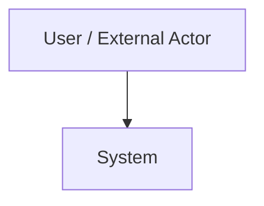
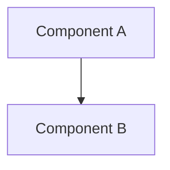
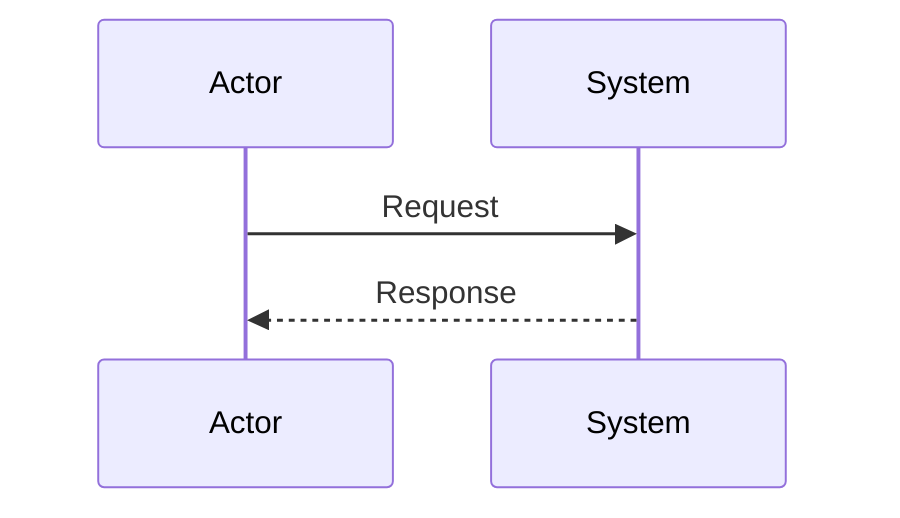
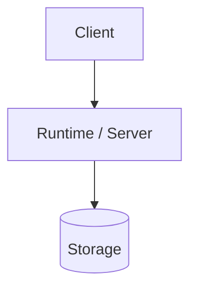

# ARCH

**pArc Architecture Contract Template**

이 문서는 구현·검증 Agent가 원 설계 대화 없이도 다음 작업을 수행할 수 있도록 정제된 Architecture Contract의 기본 template입니다. 기본 뼈대는 arc42의 12개 section을 따르고, pArc의 Agent Role & Orchestration View를 13번째 section으로 확장합니다.

## 0. 문서 제어

| 항목 | 값 |
|---|---|
| Project | TBD |
| Baseline | 0.0.0 |
| Status | Draft |
| Source Requirements | `SWE1.md` |
| Process Ledger | `SWE2.md` |
| Quality Gate | `ARCH_QGate.md` |
| References | `refs/` |
| Last Updated | TBD |

### History

| Version | Date | Comment |
|---|---|---|
| 0.0.0 | YYYY-MM-DD | Initial draft |

> 각 chapter는 `REQUIRED`, `N/A`, `DEFERRED` 중 하나의 상태를 가져야 합니다. `N/A`와 `DEFERRED`에는 이유를 기록하고, `DEFERRED`에는 revisit trigger를 추가합니다.

---

## 1. Introduction and Goals

**Status:** REQUIRED

### 1.1. Requirements Overview

- 주요 기능/목표: TBD
- 관련 요구사항 ID: TBD

### 1.2. Quality Goals

| Priority | Quality Goal | Measurable Target / Scenario | Requirement ID |
|---:|---|---|---|
| 1 | TBD | TBD | TBD |

### 1.3. Stakeholders

| Stakeholder / Role | Concern / Expectation | Authority |
|---|---|---|
| TBD | TBD | TBD |

---

## 2. Constraints

**Status:** REQUIRED

### 2.1. Technical Constraints

- TBD

### 2.2. Organizational / Process Constraints

- TBD

### 2.3. External / Regulatory / Cost Constraints

- TBD

---

## 3. Context and Scope

**Status:** REQUIRED

### 3.1. Business Context

### 3.2. Technical Context

- External systems/services/devices: TBD
- Trust/network boundaries: TBD

### 3.3. External Interfaces

| Interface ID | Partner | Direction | Protocol / Format | Ownership | Requirement |
|---|---|---|---|---|---|
| IF-001 | TBD | TBD | TBD | TBD | TBD |

---

## 4. Solution Strategy

**Status:** REQUIRED

| Strategy ID | Driver / Requirement | Strategy | Key Trade-off | Related ADR |
|---|---|---|---|---|
| STR-001 | TBD | TBD | TBD | TBD |

---

## 5. Building Block View

**Status:** REQUIRED

### 5.1. Level 1 Decomposition

| Block ID | Responsibility | Owned Data / Interface | Dependencies |
|---|---|---|---|
| BB-001 | TBD | TBD | TBD |

### 5.2. Lower-Level Decomposition

- 필요한 block만 추가합니다.

---

## 6. Runtime View

**Status:** REQUIRED

### 6.1. Critical Runtime Scenarios

| Runtime ID | Trigger / Stimulus | Main Flow | Failure / Retry / Timeout | Related Requirement |
|---|---|---|---|---|
| RT-001 | TBD | TBD | TBD | TBD |

---

## 7. Deployment View

**Status:** REQUIRED

### 7.1. Runtime / Infrastructure Topology

### 7.2. Deployment Mapping

| Node ID | Runtime / Service | Environment | Resource / Capacity | Network / Storage | Scaling / Recovery |
|---|---|---|---|---|---|
| DEP-001 | TBD | TBD | TBD | TBD | TBD |

### 7.3. Environment Differences

- Development: TBD
- Test: TBD
- Production: TBD

---

## 8. Cross-cutting Concepts

**Status:** REQUIRED

| Concept ID | Concern | Policy / Mechanism | Applies To | Verification Hook |
|---|---|---|---|---|
| XC-001 | Security | TBD | TBD | TBD |
| XC-002 | Data ownership/lifecycle | TBD | TBD | TBD |
| XC-003 | Configuration / secrets | TBD | TBD | TBD |
| XC-004 | Logging / observability | TBD | TBD | TBD |
| XC-005 | Error / retry / recovery | TBD | TBD | TBD |

---

## 9. Architecture Decisions

**Status:** REQUIRED

ADR은 별도 파일로 분산하지 않고 이 chapter에서 관리합니다. 원 설계 evidence는 `SWE2.md`의 baseline/version + heading 번호로 역추적합니다.

| ADR ID | Status | Decision | Context / Driver | Alternatives / Trade-off | SWE2 Evidence | Supersedes |
|---|---|---|---|---|---|---|
| ADR-001 | Proposed | TBD | TBD | TBD | TBD | - |

---

## 10. Quality Requirements

**Status:** REQUIRED

### 10.1. Quality Overview

| Quality ID | Attribute | Priority | Related Requirement / Driver |
|---|---|---:|---|
| Q-001 | TBD | 1 | TBD |

### 10.2. Quality Scenarios / Acceptance Obligations

| Scenario ID | Stimulus | Environment | Expected Response | Measure / Threshold | Verification Evidence |
|---|---|---|---|---|---|
| QS-001 | TBD | TBD | TBD | TBD | TBD |

---

## 11. Risks and Technical Debt

**Status:** REQUIRED

| Risk / Debt ID | Description | Impact / Severity | Mitigation / Acceptance | Owner / Authority | Revisit Trigger |
|---|---|---|---|---|---|
| RISK-001 | TBD | TBD | TBD | TBD | TBD |

---

## 12. Glossary

**Status:** REQUIRED

| Term / Acronym | Definition | Notes / Disambiguation |
|---|---|---|
| TBD | TBD | TBD |

---

## 13. Agent Role and Orchestration View

**Status:** REQUIRED

이 section은 pArc 확장입니다. 특정 Agent/Model을 먼저 고르지 않고 Engineering Role을 먼저 정의한 뒤, qualification·비용·성능 조건에 맞는 Agent/Model/Runtime을 배치합니다.

### 13.1. Role Model / RASIC

| Activity / Process | Human | Orchestrator | Architecture | Architecture Peer | Implementation | Verification / Release |
|---|---:|---:|---:|---:|---:|---:|
| TBD | TBD | TBD | TBD | TBD | TBD | TBD |

### 13.2. Role Competency and Authority

| Role ID | Responsibility | Authority Boundary | Required Input | Required Output | Qualification Evidence |
|---|---|---|---|---|---|
| ROLE-001 | TBD | TBD | TBD | TBD | TBD |

### 13.3. Agent / Model / Runtime Assignment

| Role ID | Candidate / Assigned Resource | Benchmark / Score | Context / Modality | Runtime / Location | Status |
|---|---|---|---|---|---|
| ROLE-001 | TBD | TBD | TBD | TBD | TBD |

### 13.4. Cost-Performance / Capacity

| Role ID | Quality / Performance | Token / Cost | Latency / Throughput | Compute / Energy | Rework / Failure |
|---|---|---|---|---|---|
| ROLE-001 | TBD | TBD | TBD | TBD | TBD |

### 13.5. Context and Work Partitioning

- Complete authoritative knowledge: TBD
- Work/context partition rule: TBD
- Retrieval / escalation rule: TBD

### 13.6. Scaling / Fallback / Replacement

- Scale-up/down trigger: TBD
- Fallback resource: TBD
- Replacement / eviction criteria: TBD
- Architecture Peer activation/deactivation trigger: TBD

---

## Baseline Handoff

최종 baseline 시 다음 항목을 확인합니다.

- `SWE1.md`의 material requirement/constraint가 본 문서에 반영되었거나 명시적으로 disposition 되었음.
- `ARCH_QGate.md`가 동일한 `ARCH.md` baseline/hash를 검토했음.
- 구현 Agent가 원 planning chat 없이 본 `ARCH.md + refs + source baseline`으로 작업을 시작할 수 있음.
- 오른쪽 V가 사용할 acceptance obligation과 verification hook이 왼쪽 V에서 충분히 정의되어 있음.
